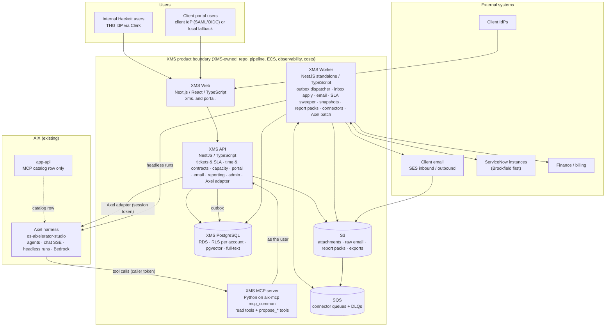

# Architecture: XMS Ticketing (standalone product, Option B)

**Status:** Draft, pending architecture sign-off
**Owner:** Matt Brown
**Last updated:** 2026-09-04
**Related:** [Product Vision](../00-overview/PRODUCT-VISION.md), [Domain Model](./DOMAIN-MODEL.md), [Data Model](./DATA-MODEL.md), [Security & Tenancy](./SECURITY-AND-TENANCY.md), [AI Integration](./AI-INTEGRATION.md), [Integration Patterns](./INTEGRATION-PATTERNS.md), [Platform & Operations](./PLATFORM-AND-OPERATIONS.md), [Design System](./DESIGN-SYSTEM.md), [AIX Pattern Reuse](./AIX-PATTERN-REUSE.md), [Decision Log](../00-overview/DECISION-LOG.md)
**Source diagram:** "Option B, XMS Ticketing as a standalone product" (assessment deck p.8, 2026-09-03)

This document fixes the system-level shape: what the product is made of, who owns what, how a request flows, and the boundaries with AIX. Everything below was checked against the AIX repos on 2026-09-04; see [AIX Pattern Reuse](./AIX-PATTERN-REUSE.md) for the file-level evidence.

---

## 1. System context

Boundary rules (from the assessment and kept here):

- **Product boundary equals technical boundary.** Failures, costs and changes stay inside XMS. The only assumed dependency is Axel; the only AIX write XMS needs is one catalog row in app-api registering the XMS MCP server.
- **No AIX code is copied**, patterns are. The design tokens are the one seeded artifact (see [Design System](./DESIGN-SYSTEM.md)).
- **Same technology family and AWS patterns as AIX**: Next.js, NestJS, TypeScript, Clerk, ECS Fargate, ECR, Azure DevOps, S3, SQS, RDS PostgreSQL in the AIX dev and prod AWS accounts.

## 2. Containers

| Container | Stack | Responsibilities | Scaling |
|---|---|---|---|
| XMS Web | Next.js (App Router), React, TypeScript, RTK Query, Clerk, Tailwind with the XMS token package | Internal app at `xms.<domain>`; portal at `portal.<domain>` (same codebase, separate route group and layout); Axel panel; exports; all rendering | ECS service, 2+ tasks, stateless |
| XMS API | NestJS, TypeScript, Drizzle, class-validator, Swagger | All domain logic and every read and write of PostgreSQL and S3; auth guard; RBAC; RLS session binding; outbox writes; Axel adapter (interactive and single-shot faces); presigned S3 | ECS service, 2+ tasks, stateless |
| XMS Worker | NestJS standalone application sharing the API's domain packages, TypeScript | Outbox dispatcher, connector handlers (ServiceNow, email out, finance, reports), inbox apply (email in, ServiceNow in), SLA breach sweeper, daily snapshots, threshold and renewal alerts, report pack rendering, Axel batch calls, retention jobs | ECS service, 1+ tasks; horizontal scaling safe because all jobs claim work with `SKIP LOCKED` or SQS |
| XMS MCP | Python, `aix-mcp` `mcp_common` scaffolding | Exposes XMS to Axel as tools; validates harness session tokens; forwards the bearer to the XMS API | ECS service, 1+ tasks |
| PostgreSQL | RDS PostgreSQL 16, Multi-AZ in prod, pgvector | System of record; account isolation by RLS; full-text and vector search; outbox and inbox; read models | Vertical; read replica for reporting when needed |
| S3 | One bucket per environment | Attachments, raw inbound email, report packs, exports, migration files; account-prefixed keys; GuardDuty Malware Protection; lifecycle rules | Managed |
| SQS | Standard queues per connector plus DLQs; one FIFO queue for ServiceNow outbound ordering | Decoupling and retry | Managed |
| SES | Inbound receipt rules per environment domain; outbound with per-account DKIM-signed sending identities | Email intake and notifications | Managed |

Repositories (separate, mirroring the AIX shape, ADR-12): `frontend` (Next.js and React, the internal app and the portal route group, the design tokens under `styles/tokens`, the Axel streaming client under `lib/axel-client`, Playwright under `e2e/`); `backend` (NestJS, with `src/domain` for entities, state machines, SLA engine and other pure rules, `src/db` for the Drizzle schema and migrations, `src/contracts` for DTOs and the permission catalog from which the OpenAPI document and the web client types are generated, `src/worker` as the second entrypoint that runs the worker from the same codebase, `test/kit` for factories and stubs); `infra` (Terraform for every AWS resource and the shared pipeline templates); and the `xms_mcp` module in the house `aix-mcp` repository (Python on `mcp_common`). The worker is not a separate repository precisely so that every business rule exists once; it is a separate image and ECS service built from `backend`.

## 3. Request flows

### 3.1 Internal user reads a queue

1. Browser sends `GET /v1/tickets?view=...` with a Clerk JWT from the XMS Clerk application.
2. The API guard verifies the token (60-second clock skew tolerance copied from AIX), resolves the XMS user, loads their account grants and permissions once per request, and rejects with 401 or 403 before any query.
3. The data layer opens a transaction, sets `xms.account_ids` from the grants, and runs the query. RLS filters rows; the service adds the view's filters.
4. The response carries server-computed SLA due times, paused state and breach latches; the browser only counts down.

### 3.2 A ticket changes state (where SLA math lives)

`POST /v1/tickets/{id}/transitions` is the only way to change state. In one transaction the ticket service validates the transition against the account's state machine, applies required-field rules, pauses or resumes clocks on the account calendar, latches breaches, writes the audit event, writes the outbox row (for connectors and notifications), and updates the ticket with an optimistic version check. Nothing else writes `state`.

### 3.3 Email becomes a ticket

SES receives mail for the account alias, stores the raw message in S3, and notifies SQS. The worker parses headers and body, matches the thread by `Message-ID`, `References`, `In-Reply-To` and the plus-address token, scores loop and auto-responder signals, resolves the sender to a contact or quarantines, strips signatures and quoted history, extracts attachments (scan pending), and calls the same ticket service the API uses with origin `email`. See [Email Intake](../02-modules/email-intake/TECHNICAL-SPEC.md).

### 3.4 Axel helps on a ticket

XMS Web opens the Axel panel; the API's Axel adapter checks the account switch, exchanges the user's Clerk token for a harness session token, and streams the harness SSE. The harness calls XMS MCP tools with a token for the same user; XMS MCP calls the XMS API, so RLS applies. Suggestions are stored and confirmed by the user. See [AI Integration](./AI-INTEGRATION.md).

### 3.5 A change syncs to ServiceNow and back

The outbox row from 3.2 is dispatched to the ServiceNow FIFO queue; the connector translates it with the instance's field and state maps and calls the instance, storing the external id and outbound watermark on the sync link. ServiceNow's later update arrives by webhook or poll into the inbox, is deduplicated, checked against the watermark to drop reflections, translated, and applied through the ticket service with origin `sync:<instance>` so it never returns to that instance. See [Integration Patterns](./INTEGRATION-PATTERNS.md) and [ServiceNow Sync](../02-modules/servicenow-integration/TECHNICAL-SPEC.md).

### 3.6 The weekly report pack

A report schedule fires in the worker (claimed with `SKIP LOCKED`), the worker reads the account's daily snapshots and live figures, requests the narrative through the Axel adapter's batch face (headless run), renders PPTX with `pptxgenjs` from the operator's template and PDF through headless Chromium, stores both in S3, and sends the distribution email with links. See [Dashboards & Report Packs](../02-modules/dashboard-and-reporting/TECHNICAL-SPEC.md).

## 4. Ownership in one sentence each

| Layer | Owns | Explicitly does not own |
|---|---|---|
| `backend/src/domain` | Entities, state machines, priority matrix, SLA engine on calendars, burn-down, capacity math, loop detection, thread matching, all pure and unit-tested | I/O of any kind |
| XMS API | HTTP contract, auth, RBAC, RLS binding, transactions, audit and outbox writes, presigned S3, the Axel adapter | Long-running work, rendering, external calls other than the harness |
| XMS Worker | Everything asynchronous: dispatch, apply, sweep, snapshot, render, send, sync | Serving HTTP to users; it exposes only health endpoints |
| XMS Web | Rendering, optimistic UX, deep links, exports of data the API returns, Axel panel UI | Computing due times, breach state, permissions, burn |
| XMS MCP | Tool surface for Axel | Any authorisation decision (it passes the caller's token through) |
| Harness | Agents, models, chat threads, produced files | XMS data at rest |

## 5. Environments

| Environment | Purpose | Data |
|---|---|---|
| local | docker-compose: PostgreSQL, LocalStack (S3, SQS, SES stub), MailHog, ServiceNow stand-in, harness pointed at dev | Seed only |
| dev | Continuous deploy from `dev`; e2e and ZAP run here; harness dev | Seed plus migration rehearsal data in a separate isolated database |
| prod | Tagged releases from `production`; harness prod | Real |

There is no demo environment; demos run on dev with the seed accounts.

## 6. Cross-cutting decisions (summary; details in the linked documents)

| Concern | Decision | Where |
|---|---|---|
| Isolation | RLS forced on every account-scoped table, session bound by the data layer, `dedicated` tier for accounts that need physical separation | [Data Model §3](./DATA-MODEL.md), [Security](./SECURITY-AND-TENANCY.md) |
| Identity | One dedicated XMS Clerk application; internal users through the THG IdP connection; portal users in one Clerk organisation per account with an enterprise SAML/OIDC connection or local fallback, pending the licensing spike | [Security §2](./SECURITY-AND-TENANCY.md), ADR-03 |
| Authorisation | Global permission guard with explicit opt-out; permission catalog in `backend/src/contracts`, validated server-side; transitive implications; role assignments in PostgreSQL only | [Security §3](./SECURITY-AND-TENANCY.md) |
| AI | Axel only, through the adapter; XMS MCP server for tools; per-account switch enforced in XMS | [AI Integration](./AI-INTEGRATION.md) |
| Async | Transactional outbox, SQS with DLQs, `SKIP LOCKED` job claiming, idempotency keys on POST | [Integration Patterns](./INTEGRATION-PATTERNS.md) |
| Email | SES v2 in-process with in-repo templates; SES receipt rules for inbound | [Email Intake](../02-modules/email-intake/TECHNICAL-SPEC.md) |
| Files | Presigned POST with `content-length-range`, MIME allowlist, GuardDuty Malware Protection gating download, lifecycle rules per account retention | [Ticket Management](../02-modules/ticket-management/TECHNICAL-SPEC.md) |
| Reporting | Daily snapshots in `rpt`, packs rendered in the worker, delivered by email as presigned links | [Dashboards & Report Packs](../02-modules/dashboard-and-reporting/TECHNICAL-SPEC.md) |
| Observability | pino structured logs with request ids, OpenTelemetry through the ADOT sidecar to X-Ray and CloudWatch, real readiness checks, alarms | [Platform & Operations](./PLATFORM-AND-OPERATIONS.md) |
| Infra | Terraform in the repo; the pipeline never patches live task definitions | [Platform & Operations](./PLATFORM-AND-OPERATIONS.md) |
| Quality | Lint, type-check, tests and the isolation suite gate the build | [Test Strategy](../03-delivery/TEST-STRATEGY.md) |

## 7. Relationship to the XMS proof of concept

The POC (web-ui `components/aix-v3/xms`, app-api `api/v3/xms` proxy, studio `xms_ticketing` module on `feature/xms-ticketing`) proved the entitlement-aware intake, pausable SLA clocks, burn-down and the ServiceNow-shaped screens. XMS ports its vocabulary, SLA math, close discipline, admin grammar and screen designs, and rebuilds them inside the XMS boundary in TypeScript. The studio module stays as a reference until XMS Phase 2 ships, then is retired (ADR-07). Nothing in XMS calls the POC endpoints.

## 8. Risks specific to the architecture

| Risk | Mitigation |
|---|---|
| Harness contract drift (`extra="forbid"` request schema, event shapes) | Contract tests with recorded fixtures per harness release; the six harness changes in [AI Integration §8](./AI-INTEGRATION.md) are tracked with the Axel owners |
| Clerk licensing or SSO topology for portal users | Spike in Phase 1; fallback is a XMS-owned portal identity realm, isolated behind the same guard interface (ADR-03) |
| Security ruling on shared tables | `dedicated` isolation tier is designed in from Phase 1 and can be applied per account |
| Brookfield integration unknowns | One-way ingest first; bidirectional only after ownership rules are agreed; field and state maps are data |
| Four developers | Foundations are deliberately narrow; every phase ships something used; the worker and API share domain code so there is one implementation of every rule |
