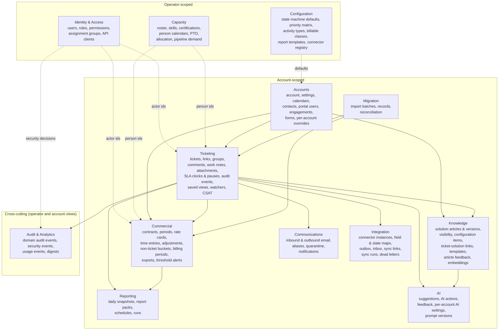

# Domain Model: XMS Ticketing

**Status:** Draft
**Owner:** Matt Brown
**Last updated:** 2026-09-04
**Related:** [Architecture](./ARCHITECTURE.md), [Data Model](./DATA-MODEL.md), [Security & Tenancy](./SECURITY-AND-TENANCY.md), [Product Vision](../00-overview/PRODUCT-VISION.md), [Glossary](../00-overview/GLOSSARY.md)

This document fixes the bounded contexts, the entities inside each, the relationships that cross contexts, and the invariants every module must respect. Column-level tables live in each module's technical spec; the table catalog and conventions live in the [Data Model](./DATA-MODEL.md).

---

## 1. The two halves of the model

Everything in the product belongs to exactly one of two halves:

| Half | Owner | Examples | Isolation |
|---|---|---|---|
| **Account-scoped** | One client account | Tickets, comments, work notes, attachments, contracts, time entries, solution articles visible to that account, portal users, calendars, AI suggestions, sync links | Every row carries `account_id`; the database enforces row-level security on every such table; a session sees one account (portal) or the set of accounts the internal user is granted (operator) |
| **Operator-scoped** | The Hackett Group | Internal users, roles, assignment groups, roster, skills, PTO, allocation, global configuration defaults, connector registry, report templates | No `account_id`; visible to internal users by role; never exposed to portal users |

The rule that makes the knowledge base the heart of the product: **solution articles are account-scoped by visibility, not by origin.** An article written while resolving a Brookfield ticket starts visible to Brookfield only; when it is generalized (client identifiers removed, marked global) it becomes visible to every account. Both states live in the same table with a visibility set, so retrieval always runs one query per account context.

## 2. Bounded contexts

Solid arrows are foreign keys; dotted arrows are opaque identity references (an internal user id stored on an account-scoped row is a string, never a foreign key across the isolation boundary, so an account's data can be moved to a dedicated database without breaking referential integrity).

## 3. Entities by context

### 3.1 Identity & Access (operator)

| Entity | Purpose | Key facts |
|---|---|---|
| User | An internal person or a portal person | `kind` internal or portal; internal users are Clerk identities from the THG IdP; portal users belong to exactly one account and authenticate through that account's identity provider or a local fallback |
| Role | Named permission set | Two catalogs: operator roles (consultant, dispatcher, account owner, finance, administrator) and portal roles (requester, account admin, read-only). Permissions are string keys (`tickets:resolve`, `time:lock-period`, `portal:view-consumption`) |
| Role assignment | User to role, optionally scoped to accounts | An internal user may hold "consultant" on all accounts and "account owner" on two |
| Assignment group | CSM, OneStream Technical, Infrastructure, and any later group | Members are internal users; tickets are assigned to a group and optionally to an individual in it |
| Account grant | Which accounts an internal user may see | The source of the account set bound to the database session; absence means no access |
| API client | Machine identity for Axel, connectors and finance | Scoped to account sets and permission sets; secrets hashed; never a user |

### 3.2 Accounts (account-scoped root)

| Entity | Purpose | Key facts |
|---|---|---|
| Account | The client organisation | Display key, status, isolation tier (shared or dedicated database), data residency region, default time zone, branding for outbound email, inbound aliases |
| Account settings | Switches that change behaviour per account | AI enabled, AI opt-ins per request type, consumption visible in portal, portal enabled, CSAT enabled, sync mode |
| Business calendar | Working hours and holidays in a time zone | An account has one default calendar and may have more (regional coverage); SLA clocks reference a calendar |
| Contact | A person at the account who may not be a portal user | Email identity for inbound matching and CC on outbound |
| Engagement | The commercial relationship | Holds contracts, the account owner, renewal dates |
| Ticket form | Dynamic submission form per request type | Field definitions with required flags, options and visibility; versioned |
| Account overrides | Per-account state machine, priority matrix and SLA policy overrides | Absent override means the operator default applies |

### 3.3 Ticketing

| Entity | Purpose | Key facts |
|---|---|---|
| Ticket | The unit of work | Type (Incident, Service Request, Change, Problem, Project Task), state, priority, impact, urgency, category, assignment group, assignee, contract, requester, source (portal, email, internal, api, sync, import), configuration item, out-of-scope flag with approval state, external references |
| Ticket link | Relationship between tickets | Parent/child, related, duplicate of, blocks/blocked by; links are directional rows with the inverse implied |
| Ticket group | Project or change window | A named container with a schedule that a ticket tree belongs to (one tree per cutover weekend) |
| Comment | Public, client-visible message | Author may be internal, portal or system; body plus rendered inline images; the first operator comment stamps response-met |
| Work note | Internal message | Separate table from comments so no query can accidentally return both; never syncs publicly |
| Attachment | File on a ticket or a message | S3 key, content type, size, scan state (pending, clean, quarantined), uploader, origin (portal, email, internal, sync) |
| SLA clock | One timer on one ticket | Kind (response, resolution), policy reference, calendar, target minutes, due at, elapsed business minutes, paused flag, breached latch, met at |
| SLA pause | One pause interval with reason | Reason code (awaiting client, awaiting third party, scheduled window), started, ended, business minutes excluded; this is the hour-justification evidence |
| Audit event | Append-only change record | Entity, field, old value, new value, actor (user, api client, system, AI), correlation id; never updated or deleted |
| Saved view | User-defined filter | Filter definition, columns, sort, sharing (private, group, account) |
| Watcher | Subscription to a ticket | Internal or portal user; drives notifications |
| CSAT response | Survey answer | On close (per ticket) or quarterly (per account); score, comment, respondent |

### 3.4 Knowledge (the heart)

| Entity | Purpose | Key facts |
|---|---|---|
| Solution article | A documented fix or procedure | Title, problem statement, environment, steps, verification, rollback, self-service eligibility, status (draft, in review, published, retired), owner, visibility set, origin ticket |
| Article version | Immutable content snapshot | Every publish creates a version; tickets link to the version they used |
| Article visibility | Which accounts may see the article | Global flag or explicit account set; enforced in the same row-level security policy as every other account-scoped table |
| Configuration item | Lightweight asset register entry | Per account: environment, application, integration, server; type, name, attributes, owner contact; tickets and articles link to CIs |
| Ticket solution link | The resolution record | Ticket to article version with outcome (resolved by, partially resolved by, article created from); required on close unless the resolution code is one of the no-solution codes |
| Ticket template | Pre-filled ticket for recurring requests | Fields, default type, form, checklist; optional link to the article that explains the procedure |
| Article feedback | Was this useful | From internal users and portal users; feeds article ranking and retirement |
| Embedding | Vector for retrieval | One row per article version and per resolved ticket summary; account-scoped; regenerated when content changes; the per-account AI switch controls whether rows exist at all |

### 3.5 Commercial

| Entity | Purpose | Key facts |
|---|---|---|
| Contract | Commercial agreement under an engagement | Model (retainer, prepaid block, time and materials, fixed fee), period cadence, hours or value, rollover rule, overage rule, SLA policy reference, currency |
| Contract period | One budget period | Contracted hours and value, carried-over hours, consumed (derived), locked flag |
| Rate card | Effective-dated rates | By account, contract and role; a new version never edits an old one |
| Time entry | Immutable work record | Ticket or non-ticket bucket, person, date performed, minutes, activity type, billable class, description, after-hours flag, rate snapshot, billing period |
| Time adjustment | Correction or write-off | Separate row linked to the original entry; the original is never edited |
| Non-ticket bucket | Per-account time categories outside tickets | Governance, QBR preparation, account management, escalation handling |
| Billing period | Lockable per-account period | Open, submitted, approved, locked, exported; a locked period rejects new or adjusted entries dated inside it |
| Billing export | A produced export | Format, file, checksum, period, produced by |
| Threshold alert | Consumption alert configuration and firing record | Percent thresholds, recipients (internal, optionally client), fired-at markers per period |

### 3.6 Capacity (operator)

| Entity | Purpose | Key facts |
|---|---|---|
| Person | Roster entry for an internal user | Role, FTE percent, cost rate, bill rate, time zone, working calendar, start and end dates |
| Skill and certification | Capability tags with level and expiry | Feed the skills matrix and single-point-of-failure flags |
| Person calendar and PTO | Availability inputs | Per-country holiday calendar plus individual PTO |
| Allocation | Planned hours per person per account per period | Editable by team leads; the planned side of planned vs actual |
| Capacity snapshot | Computed availability per person per period | Contracted minus PTO minus holidays minus admin overhead |
| Pipeline demand | Forward demand not yet on the roster | From sales pipeline and project plans |

### 3.7 Communications

| Entity | Purpose | Key facts |
|---|---|---|
| Inbound message | A received email | Raw S3 key, parsed headers (Message-ID, References, In-Reply-To), sender, resolved account and ticket, disposition (created, appended, quarantined, suppressed), loop score |
| Outbound message | A sent email | Ticket, recipient set, Message-ID, In-Reply-To, template, branding, delivery status |
| Inbound alias | Address to account routing | Existing client-facing addresses are retained as aliases |
| Quarantine item | Unknown sender or suspicious content awaiting review | Reviewer decision creates a contact, a ticket, or discards |
| Notification | In-app or email notification to a user | Type, entity, read state, delivery state |

### 3.8 Reporting

| Entity | Purpose | Key facts |
|---|---|---|
| Daily snapshot | Point-in-time measures per account | Backlog by age, SLA attainment and at-risk, MTTR by type, reopen rate, volume, utilisation, burn; never recomputed after the day closes |
| Report pack | A generated WSR or QBR | Account, period, template, narrative version, PPTX and PDF keys, status |
| Report schedule | When and to whom | Cadence, distribution list, format |
| Report run | One execution | Started, finished, outcome, delivery log |

### 3.9 Integration

| Entity | Purpose | Key facts |
|---|---|---|
| Connector instance | One external system for one account | Type (ServiceNow, finance export, calendar), auth reference, mode (off, ingest only, bidirectional), kill switch, health |
| Field map and state map | Configuration, not code | Per instance; versioned; validated before activation |
| Outbox | Domain changes to deliver | Written in the same transaction as the change; correlation id; delivery attempts |
| Inbox | Received external changes | Deduplicated by external id and watermark; source of loop prevention |
| Sync link | External record to ticket | External id, last outbound and inbound watermarks, system of record per field |
| Sync run and dead letter | Execution history and failures | Retained with error and payload for replay |

### 3.10 AI

| Entity | Purpose | Key facts |
|---|---|---|
| AI settings | Per-account switches and thresholds | Enabled, opt-ins per capability, confidence thresholds, model policy |
| AI suggestion | A proposal from Axel | Capability (categorise, prioritise, duplicate, summarise, draft, similar, narrative, time nudge, anomaly), payload, confidence, prompt version, model, status (offered, accepted, rejected, expired, withheld) |
| AI action | The audit record of what AI did | Always an audit event with actor kind AI; links to the suggestion and the confirming human |
| AI feedback | Accept, reject, edit-before-accept | Feeds accuracy measurement and threshold tuning |

### 3.11 Audit & Analytics (cross-cutting)

| Entity | Purpose | Key facts |
|---|---|---|
| Audit event | What changed (exists as `acct.audit_events`) | Field-level, append-only, same transaction as the change |
| Security event | Who got in, who was refused, who reached what | `sys.security_events`, operator-scoped with optional account, written by the guard, data layer, adapter and worker |
| Usage event | What people did on screens and the API | `rpt.usage_events`, from the frontend telemetry client and the API middleware, no content, hashed search terms |
| Integrity digest | Tamper evidence | Chained daily SHA-256 per stream in an Object Lock bucket, verified weekly |

One envelope and one typed catalog serve all three streams; see [Audit Log and User Analytics](./AUDIT-AND-ANALYTICS.md).

### 3.12 Migration

| Entity | Purpose | Key facts |
|---|---|---|
| Import batch | One extraction from ServiceNow | Source instance, object type, extracted range, counts, checksums |
| Import record | Source row to target row | Source id, target id, status, errors |
| Reconciliation report | Counts and hour totals source vs target | Signed off before cutover |

## 4. Invariants (every module must hold these)

1. **No account-scoped row without `account_id`**, and no foreign key from an account-scoped table to another account's row. Cross-account references (duplicate-of across accounts, shared articles) go through explicit visibility sets, never foreign keys.
2. **Work notes and comments are different tables.** A portal query, a public sync, and a report can only read comments. There is no `visibility` column to get wrong.
3. **Audit events, time entries, SLA pauses, inbound messages and snapshots are append-only.** Corrections are new rows that reference the old one.
4. **The server computes SLA due times, breach latches, priority from the matrix, burn-down and capacity.** Clients render them.
5. **A breach latch is never cleared.** Pausing after the fact, editing priority, or reopening never un-breaches.
6. **A ticket cannot reach Resolved or Closed** without logged time (or an exemption reason), a resolution code, and a solution link or a new-article candidate (unless the code is a no-solution code such as Duplicate or Cancelled by client).
7. **A locked billing period rejects writes** dated inside it, including adjustments; a correction after lock is an adjustment dated in the current open period that references the original.
8. **An AI action only exists as a confirmed suggestion**, except where the account has opted a capability into automatic mode, in which case the audit event records "auto-applied by policy" with the policy version.
9. **If an account's AI switch is off, no row of that account's data reaches the Axel adapter**, no embedding rows exist for it, and existing suggestions are hidden. The switch is enforced in the adapter and in a database policy on the AI and embedding tables.
10. **Every external change carries a correlation id**, and a change that originated from a connector is never echoed back to that connector.
11. **Every ticket display key is unique per operator** (`CS0001234`), not per account, because clients quote keys on calls and ServiceNow keys are migrated verbatim into an external reference field.

## 5. Module ownership

| Context | Owning module spec | Also read by |
|---|---|---|
| Identity & Access, Accounts, Configuration | [Accounts & Administration](../02-modules/accounts-and-administration/FUNCTIONAL-SPEC.md) | every module |
| Ticketing | [Ticket Management](../02-modules/ticket-management/FUNCTIONAL-SPEC.md) | Portal, Email, Reporting, AI, Sync |
| Knowledge | [Solution Knowledge Base](../02-modules/knowledge-base/FUNCTIONAL-SPEC.md) | Ticketing, Portal, AI |
| Commercial | [Time, Contracts & Budget](../02-modules/time-and-budget/FUNCTIONAL-SPEC.md) | Reporting, Portal, Integrations |
| Capacity | [Capacity & Allocation](../02-modules/capacity-and-allocation/FUNCTIONAL-SPEC.md) | Reporting, AI |
| Portal users, forms, CSAT, consumption view | [Client Portal](../02-modules/client-portal/FUNCTIONAL-SPEC.md) | Ticketing |
| Communications | [Email Intake & Outbound](../02-modules/email-intake/FUNCTIONAL-SPEC.md) | Ticketing, Reporting |
| Reporting | [Dashboards & Report Packs](../02-modules/dashboard-and-reporting/FUNCTIONAL-SPEC.md) | AI (narrative) |
| Integration (ServiceNow) | [ServiceNow Sync](../02-modules/servicenow-integration/FUNCTIONAL-SPEC.md) | Integration patterns |
| Integration (finance, identity, alerts, chat, calendar) | [Platform Integrations](../02-modules/integrations/FUNCTIONAL-SPEC.md) | Commercial |
| AI | [Axel AI Functionality](../02-modules/ai-functionality/FUNCTIONAL-SPEC.md) | every module that offers a suggestion |
| Migration | [Data Migration & Cutover](../02-modules/data-migration/FUNCTIONAL-SPEC.md) | Ticketing, Commercial, Sync |
| Audit & Analytics | [Audit Log and User Analytics](./AUDIT-AND-ANALYTICS.md) (architecture document; screens owned by Accounts & Administration, measures by Dashboards) | every module emits |
