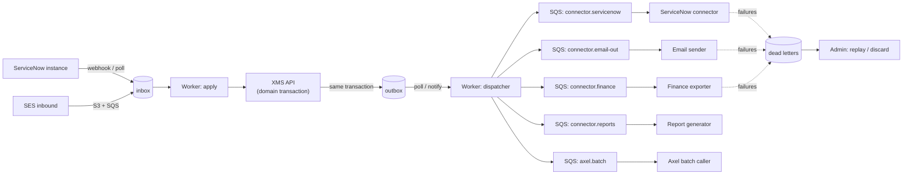

# Integration Patterns: the XMS connector framework

**Status:** Draft
**Owner:** Matt Brown
**Last updated:** 2026-09-04
**Related:** [Architecture](./ARCHITECTURE.md), [Data Model](./DATA-MODEL.md), [ServiceNow Sync](../02-modules/servicenow-integration/TECHNICAL-SPEC.md), [Email Intake](../02-modules/email-intake/TECHNICAL-SPEC.md), [Platform Integrations](../02-modules/integrations/TECHNICAL-SPEC.md), [Axel AI](../02-modules/ai-functionality/TECHNICAL-SPEC.md)

Every external interaction in XMS (ServiceNow instances, inbound and outbound email, finance export, report delivery, Axel batch calls, later Slack, Teams and calendars) runs on one framework in the worker. This document fixes that framework so each connector spec only describes its mapping and its endpoints, not its plumbing.

---

## 1. Why one framework

The workbook asks for idempotency, loop prevention, retries, dead-letter retention with alerting and replay, conflict policy, multiple concurrent instances, one-way mode as a fallback, and a kill switch (SN-01 to SN-09, EM-06, TB-14, DR-05). Those are properties of the plumbing, not of ServiceNow. Building them once and proving them once means the Brookfield connector, the finance export and the report mailer share the same guarantees and the same operator screen.

## 2. Components

| Component | Responsibility |
|---|---|
| Outbox table | One row per domain change that may need delivery, written in the same database transaction as the change. Columns: id, account_id, aggregate (ticket, comment, attachment, time entry, report), aggregate id, event type, payload (the change, not the whole record), correlation id, causation id, origin (user, api, sync:<instance>, ai, system), created at, dispatched at |
| Dispatcher | Polls the outbox in id order per account, fans each row out to the queues whose connector instances subscribe to that event type for that account, marks it dispatched. At-least-once; consumers are idempotent |
| Connector queues | One SQS standard queue per connector type plus one DLQ each; visibility timeout sized to the connector's worst call; max receive count 5 |
| Connector | Stateless handler: load the connector instance config, translate, call the external system, record the result on the sync link, emit a sync run row |
| Inbox table | One row per inbound message keyed by (connector instance, external id, external version or hash); duplicates are dropped before any domain write |
| Apply | Translates an inbox row into domain calls through the same services the API uses, with origin `sync:<instance>` so the change is attributed and never echoed back |
| Dead letters | Rows retained with payload, error, attempt count, first and last failure, and a resolution state; the admin screen replays or discards with a reason |
| Kill switch | Per connector instance: off, ingest only, bidirectional. Flipping to off stops dispatch and apply for that instance without losing queued work |

## 3. Guarantees and how each is achieved

| Guarantee | Mechanism |
|---|---|
| **Nothing is lost** | Outbox rows are written transactionally with the change; SQS with DLQ retains anything the connector cannot deliver after retries |
| **Nothing is applied twice** | Inbox uniqueness on (instance, external id, external version); connector calls carry an idempotency key derived from the outbox id; the external side's own id is stored on the sync link before any second call |
| **No loops** | Every change carries origin and correlation id. A change whose origin is `sync:X` is never dispatched to instance X. Each sync link stores the last outbound watermark (what we sent) and the last inbound watermark (what we received); an inbound change equal to our last outbound value is a reflection and is dropped |
| **Ordering per ticket** | Outbox dispatch is ordered by id within an account; connectors use the ticket id as the SQS message group where ordering matters (FIFO queue for ServiceNow), otherwise standard queues |
| **Retries with backoff** | SQS redrive with exponential visibility (30s, 2m, 10m, 30m, 2h) before the DLQ; connectors classify errors as retryable (5xx, timeouts, 429) or terminal (4xx validation, mapping failures) and send terminal errors straight to the DLQ |
| **Conflict policy** | Per field, per instance: `xms` (XMS is the system of record, inbound changes to that field are ignored and logged), `external` (the external system wins), `newest` (compare timestamps, only allowed for free-text fields), `merge` (comments and work notes append). Last-write-wins is not a blanket rule and is not the default |
| **Multiple instances** | Connector config is data (instance rows with their own auth reference, field map version, state map version, mode). The same handler code serves every instance |
| **Fallback to one-way** | Mode `ingest_only` disables dispatch for that instance; apply continues. This is both the starting configuration and the emergency posture when write-back is suspended |
| **Observability** | Every attempt is a sync run row; per-instance health (last success, backlog, DLQ depth, error rate) is exposed on the admin screen and as CloudWatch metrics with alarms |
| **Manual replay** | Admin replays a dead letter (re-enqueues with the original payload and a new attempt) or discards it with a reason; both are audit events |

## 4. Configuration as data

| Object | Contents |
|---|---|
| Connector instance | Type, account, display name, mode, auth reference (secret name in Secrets Manager, never the secret), endpoint base, schedule for polling types, kill switch, health thresholds |
| Field map (versioned) | External field to XMS field, direction (in, out, both), transform (identity, lookup table, template, script-free expression), conflict policy per field |
| State map (versioned) | External state to XMS state per ticket type and direction; a transition that the XMS state machine forbids is applied as the nearest allowed state and logged |
| Subscription | Which outbox event types an instance receives |
| Test fixtures | Sample external payloads stored per instance so a mapping version can be validated before activation |

Field and state map versions are validated (every required field mapped, every external state mapped, no two XMS states mapping to one external state in the outbound direction without a tie-break) before they can be activated. Activation is an audit event.

## 5. Security

- Credentials live in AWS Secrets Manager; the connector instance stores the secret name. Rotation does not touch the database.
- Outbound calls go through a NAT with a fixed egress IP that clients can allowlist.
- Inbound webhooks are authenticated (HMAC or per-instance token) and rate limited at the ALB; unauthenticated posts are dropped before they touch the inbox.
- Inbound payloads are stored raw in S3 (account-prefixed) for forensic replay, with the retention policy of the account.
- Work notes never enter a public-direction outbox event, by construction: the outbox event type for work notes exists only for internal-direction subscriptions (a ServiceNow instance configured for work-note sync receives them as work notes, never as comments).

## 6. Local development and testing

- A local ServiceNow stand-in (a small Express app that implements the subset of the Table API the connector uses, with fixtures) runs in docker-compose so the connector can be developed without a client instance.
- Contract tests per connector: given an outbox row and a mapping version, assert the exact external request; given an external payload, assert the exact domain calls.
- Loop tests: a change dispatched to instance X, echoed back by the stand-in, must produce no second outbox row.
- Chaos tests: the stand-in returns 500 then 200; assert one delivery, one sync run failure, one success, no DLQ row. The stand-in returns 400; assert a DLQ row and an alarm metric.

## 7. What each connector spec must add

Each connector's technical spec adds only: the external API surface used, the default field and state maps, the auth model, polling or webhook details, volume assumptions, and the connector-specific error classification. Everything else is this framework.
