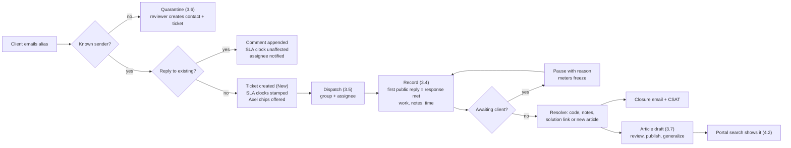
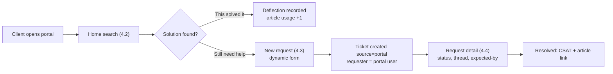
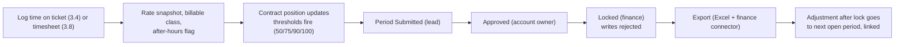

# User Experience: XMS screens and flows

**Status:** Draft
**Owner:** Matt Brown
**Last updated:** 2026-09-04
**Related:** [Wireframes v2](./WIREFRAMES.md), [Design System](./DESIGN-SYSTEM.md), [Architecture](./ARCHITECTURE.md), [Domain Model](./DOMAIN-MODEL.md), [Product Vision](../00-overview/PRODUCT-VISION.md), module functional specs under `02-modules/`
**Grounded in:** the XMS proof of concept (`web-ui/components/aix-v3/xms/`: `QueueTab.tsx`, `NewTicketPage.tsx`, `TicketDrawer.tsx`, `DispatchTab.tsx`, `ContractsTab.tsx`, `DashboardTab.tsx`, `XmsAdminPages.tsx`, `XmsWorkspace.tsx`) and its POC audit

This document is the UX contract for `frontend`: how the product is organised, what every screen is for, what it must do, and how the screens chain into the flows that matter. Module functional specs describe behaviour per domain; this document is the one place that describes the whole experience end to end. Visual tokens and component grammar are in the [Design System](./DESIGN-SYSTEM.md).

---

## 1. Experience principles

1. **One screen per job, and the job finishes on that screen.** A consultant works a ticket without leaving the record: reply, note, log time, attach, link a solution, resolve. A dispatcher assigns without opening the ticket. A client submits without learning the product.
2. **Honest clocks, everywhere the ticket appears.** SLA state is the same badge on the list, the record, the dashboard and the portal, computed by the server, counting down in the browser, never inferred by the user.
3. **Dense by default for staff, guided by default for clients.** The internal app is a ServiceNow-shaped desk: edge-to-edge lists, condition builder, label-left record forms, keyboard first. The portal is a search-first, form-guided surface with large targets and plain language.
4. **Knowledge in the path of work, not beside it.** Similar solutions appear in the ticket rail as soon as a ticket exists; closing asks for the solution link; the portal shows solutions before the submit button. Nobody "goes to the knowledge base".
5. **Axel is a rail and a chip, not a chatbot tab.** Suggestions land inline where the decision is made (a category chip, a priority chip, a draft in the composer, a summary above the thread). The full panel exists for conversation, but the daily value is inline and one click to accept.
6. **Evidence is visible.** Pause reasons, breach moments, adjustments, AI actions and imports are visible in the activity stream with who and when, so the hour-justification conversation happens from the screen, not from memory.
7. **No dead ends.** Every empty state names the next action (create the first contract, invite a portal user, connect an instance). Every error says what to do.
8. **Fast paths for the ten-times-a-day actions.** Log time, reply, change state, assign, search: each has a keyboard shortcut and never more than two clicks.
9. **The client sees their slice, completely, and nothing else.** No internal vocabulary, no work notes, no rates, no other accounts. The portal is a different product skin over the same truth.
10. **Configuration is a screen, not a ticket to engineering.** State machines, calendars, SLA policies, forms, field maps and AI switches are edited by administrators with preview and validation.

## 2. Information architecture

Two hosts, one codebase (`frontend`):

| Host | Audience | Shell |
|---|---|---|
| `xms.<domain>` | Internal Hackett users | Docked left navigation (collapsible), slim top bar (global search, quick create, Axel, notifications, user), full-bleed work surfaces |
| `portal.<domain>` | Client users | Account-branded header, top navigation with five items, centred content, no sidebar |

### 2.1 Internal navigation (docked sidebar)

| Section | Screens | Visible to |
|---|---|---|
| Home | My Work | everyone |
| Tickets | Queue, Dispatch, Quarantine, New ticket | consultants, dispatchers, account owners |
| Knowledge | Solutions, Review queue, Configuration items, Templates | everyone; authoring per permission |
| Time | My timesheet, Team time, Billing periods | consultants (own), leads (team), finance (periods) |
| Accounts | Account list, Account record, Contracts | account owners, admins, finance |
| Capacity | Roster, Allocation grid, Skills matrix, Planned vs actual | leads, practice leads |
| Reports | Operations dashboard, Portfolio, Account dashboards, Report packs, Exports | per role |
| Admin | Users, Roles, Groups, Configuration, Connectors, Migration, AI, Audit | administrators |

The sidebar shows only sections the user's permissions allow (fail closed while loading, per the AIX settings-sidebar rule). Every list screen has a URL that encodes its view, so a link is a saved filter.

### 2.2 Global elements (internal)

| Element | Behaviour |
|---|---|
| Global search (omnibox, `/`) | Searches tickets (key, title, requester, body), solutions, accounts, people. Results grouped by type; Enter opens the top hit; typing `CS` and digits jumps straight to a ticket |
| Quick create (`c`) | New ticket (full-screen record form), new solution, new time entry (for a chosen ticket) |
| Axel button | Opens the docked split panel on the right (resizable, remembers width); the panel is context-aware: on a ticket it is that ticket's assistant, elsewhere it is the desk assistant |
| Notifications bell | Unread count, grouped feed (assigned to you, mention, SLA at risk, breach, approval needed, report ready, AI suggestion withheld to human queue), mark all read, per-type mute |
| User menu | Profile, time zone, notification preferences, sign out |
| Command palette (`Ctrl+K`) | Every navigation target and every action on the current record by name |

### 2.3 Portal navigation

Home · Requests · Knowledge · Consumption (only when the account setting allows) · Account (only for portal account admins). Plus the account's logo, the signed-in person, and a persistent "New request" button.

## 3. Screen catalog: internal application

Each screen: purpose, who uses it, layout, what it must do, states, Axel touchpoints, requirement coverage. Layout notes reference the POC file that already demonstrates the grammar.

### 3.1 My Work (Home)

- **Purpose.** The personal cockpit: what needs me now.
- **Who.** Every internal user; the landing page.
- **Layout.** Left two thirds: "Needs attention" list sorted by SLA urgency (my assigned tickets, then my group's unassigned), each row with key, title, account, SLA badge, state pill. Right third: three stacked cards: **Time today** (logged vs expected, the unlogged-time nudge from Axel with one-click "log now"), **Mentions and replies** (public replies from clients on my tickets, work-note mentions), **Waiting on me** (approvals: out-of-scope flags, article reviews, narrative reviews, quarantine items if I am a reviewer).
- **Must do.** Open any row in the ticket record; log time from the nudge without leaving; mark mentions read; show breached and at-risk counts as scorecards at the top that filter the list on click.
- **States.** New user with nothing assigned: a welcome card pointing to Queue and to "Set up your time zone". No unlogged time: the card says so and collapses.
- **Axel.** The unlogged-time nudge (AI-06) and a one-line daily brief ("Two P1s on Brookfield are within an hour of breach").
- **Covers.** TM-15 (views), TB-02, AI-06, DR-01.

### 3.2 Queue (ticket list)

- **Purpose.** The working list for everything ticket-shaped, for one account or all granted accounts.
- **Who.** Consultants, dispatchers, account owners.
- **Layout.** Exactly the POC `QueueTab.tsx` grammar: slim toolbar (funnel, "Show" dimension dropdowns, search, New), a condition builder (field, operator, value rows, AND-stacked, with a breadcrumb trail where clicking a segment removes that criterion), then an edge-to-edge sticky-header table with zebra rows. Default columns: Key, Title, Account, Type, Priority, State, Assignee, Group, SLA, Updated. Columns are choosable and their order is saved with the view.
- **Must do.** Saved views (private, group, account) with a name, a URL and an optional badge count in the sidebar; system views: My tickets, My group, Unassigned, Breached, At risk (under 25 percent remaining), Awaiting client, Awaiting approval, Recently resolved. Row click opens the record in place (URL changes to the ticket, browser back returns to the list with scroll position kept). Multi-select for bulk actions (assign, change state where allowed, add tag, link to group) with a confirmation that names the count and writes one audit event per record (TM-16). Inline SLA badge counts down every 30 seconds. Export the current view to Excel or CSV with the same columns (DR-06).
- **States.** No contract yet on the selected account: ink banner "Set up a contract to start taking tickets" with a link. No rows for the view: "Nothing here" with the view name and a clear-filter action. Server error: the last data stays visible with a retry bar.
- **Axel.** None on the list itself (the list must stay fast); duplicate and triage suggestions appear as small chips only on rows that have offered suggestions.
- **Covers.** TM-15, TM-16, DR-06, DR-01.

### 3.3 New ticket (full-screen record form)

- **Purpose.** Create a ticket with everything the state machine and the SLA engine need, in one pass.
- **Who.** Consultants (phone and chat intake), dispatchers.
- **Layout.** The POC `NewTicketPage.tsx` shape: slim top bar (back, "Ticket · New record", Cancel, Submit), two-column label-left grid with required asterisks, full-width Short description and Description, attachments drop zone at the bottom.
- **Fields, in order.** Account (searchable; defaults to the only granted account), Requester (contact search with "seen on this account" suggestions; create-contact inline), Type (Incident, Service Request, Change, Problem, Project Task), Form (when the account has a dynamic form for the type, its fields appear below), Category, Configuration item, Impact, Urgency, Priority (derived and read-only unless the user holds the override permission, with the matrix cell shown), Contract (defaulted when one active contract; shows hours remaining), Group, Assignee (roster combobox with capacity warning), Short description, Description, Attachments, Watchers.
- **Must do.** Show the SLA targets that will apply as soon as account, type and priority are known ("Response 4h, Resolution 24h on Brookfield UK calendar"). Warn, not block, when the assignee is over capacity (CAP-06). Warn when the contract is expired, exhausted or out of period. Create and open the record with a toast "CS0001235 created". Support "Create and new" for batch intake. Offer templates (TM-17) from a "Use template" menu that pre-fills fields and a checklist.
- **States.** Validation inline per field; no SLA policy for the priority is not an error (the badge will read "No SLA").
- **Axel.** After the short description has more than a few words, suggestion chips appear under Category, Priority and Duplicates ("Looks like CS0001198, opened yesterday") with accept and dismiss (AI-01, AI-02). Accepting fills the field and records the decision.
- **Covers.** TM-02, TM-04, TM-05, TM-14, TM-17, CP-03 (same forms), AI-01, AI-02, CAP-06.

### 3.4 Ticket record (the core screen)

- **Purpose.** Work a ticket to completion without leaving.
- **Who.** Everyone internal.
- **Layout.** The POC `TicketDrawer.tsx` grammar, promoted to a full route: a thin record bar (key, title inline-editable, state pill with the transition menu, priority pill, SLA badge, Axel button, more menu), then three zones:
  1. **Properties** (left column, label-left, commit on change or blur, optimistic with rollback and a toast on 409): Account, Requester, Type, Category, CI, Impact, Urgency, Priority, Contract, Group, Assignee, Source, Out-of-scope flag, Group or change window, External reference (ServiceNow number), Created, Resolved, Closed.
  2. **Work area** (centre, tabbed): **Conversation** (composer at top with a Public reply / Work note toggle, attachments, templates, "Draft with Axel"; thread below with visibility chips, first-response marker, email metadata on email-originated messages, expand raw email), **Activity** (every audit event with actor kind chips: user, portal, system, sync, AI; filter by kind), **Time** (this ticket's entries by person and activity type with totals, add entry inline, adjustments visible as linked rows), **Resolution** (code, notes, solution link or "Create article from this ticket", exemption reason for time, the close discipline checklist), **Links** (parent, children, related, duplicates, blocks; add by key), **Sync** (visible when the account has a connector: external record, direction, last in and out, conflicts, "Open in ServiceNow").
  3. **Rail** (right, slim, sectioned cards): **SLA meters** (Response and Resolution as horizontal meters with target, elapsed, remaining, pause segments and the pause reason; breached meters lock red with the overage; "Pause" and "Resume" actions with a reason picker), **Contract position** (hours this period, burn bar, forecast, link to the contract), **Solutions** (Axel similar solutions and similar resolved tickets, each with "Use" and "Not relevant"), **Configuration item** card, **Watchers**, **Attachments** (scan state visible; quarantined shows a placeholder).
- **Must do.** Transition through the state pill only, with the transition menu showing only allowed next states and prompting for required fields (pause reason, resolution code and solution, approval). Public replies send email to the requester and watchers with correct threading; work notes never leave. "Summarise" produces a collapsible summary above the thread (AI-03). "Draft with Axel" fills the composer with a draft the user edits before sending (AI-04). Log time in under five seconds from the Time tab or the `t` shortcut. Reopen from Resolved keeps breach latches and the original due times visible.
- **States.** Read-only banner when the ticket is Closed or Cancelled; "Awaiting approval" banner when the out-of-scope flag is pending, with the approver named; "Synced from ServiceNow" banner for fields where the external system is the system of record.
- **Axel.** Summary, draft reply, similar solutions, category and priority chips on a still-New ticket, and the docked panel for questions ("what changed since yesterday").
- **Covers.** TM-03, TM-05, TM-07, TM-09, TM-10, TM-11, TM-12, TM-13, TM-14, TB-01, TB-02, TB-10, AI-03, AI-04, AI-07, SN-05.

### 3.5 Dispatch

- **Purpose.** Route what nobody owns yet, fast.
- **Who.** Dispatchers and team leads.
- **Layout.** The POC `DispatchTab.tsx` list, extended: unrouted tickets (no group or no assignee) oldest first, with inline Group and Assignee pickers and a Confirm per row; a right rail showing the current capacity of the selected group's people for this period (from the capacity check endpoint) so the dispatcher sees who has room before assigning.
- **Must do.** Assign in one click per row; show an overallocation warning inline and allow override with a reason (CAP-06); show the count badge in the sidebar; support "assign to me".
- **States.** "Nothing waiting for triage."
- **Axel.** Suggested assignee chip per row based on skills, familiarity and capacity (AI-16, Phase 4).
- **Covers.** TM-08, CAP-06, AI-16.

### 3.6 Quarantine (email review)

- **Purpose.** Decide what happens to email that could not be trusted automatically.
- **Who.** Consultants on the intake rota; dispatchers.
- **Layout.** List of held messages (received, sender, subject, alias, reason: unknown sender, loop suspicion, attachment quarantined), with a preview pane showing the parsed body, headers summary and attachments with scan state.
- **Must do.** Three decisions per item: Create contact and ticket, Append to ticket (search by key), Discard with reason. Bulk discard for obvious spam. Show the loop score and the last ten messages from the same sender when loop suspicion is the reason. Disabled alias banner with re-enable for admins.
- **Covers.** EM-06, EM-07.

### 3.7 Solutions (knowledge base list and record)

- **Purpose.** Author, review, generalize and find documented solutions.
- **Who.** Everyone can search; authors and publishers per permission.
- **List layout.** Same list grammar as Queue: key (KB000123), title, account visibility (Global or account chips), status (Draft, In review, Published, Retired), CI, used-by count, last verified, feedback score. Views: Mine, In review, Published for account X, Stale (not verified in 6 months).
- **Record layout.** Article editor with the fixed structure as sections (Problem, Environment and CI, Symptoms, Steps, Verification, Rollback, Self-service eligibility, Effort) and a rail: origin ticket, tickets resolved by this article (with the version used), visibility editor, versions, feedback, "Generalize" action. The identifier checklist runs before publish or generalize and shows findings inline (account names, contact names, hostnames, emails).
- **Must do.** Create from a resolved ticket with the ticket's resolution notes pre-filled (Axel draft, AI-07 and ADR-05); publish creates an immutable version; retire keeps links; portal preview shows exactly what a client would see.
- **Review queue.** A list of articles In review with approve, request changes and a diff against the previous version.
- **Configuration items.** Per account list and record (type, name, attributes, owner contact, linked tickets and articles).
- **Templates.** List and editor of ticket templates with fields, checklist and the article that explains the procedure.
- **Covers.** CP-08, AI-07, TM-17, TM-19, AI-17 (runbook flag, Phase 4).

### 3.8 Time

- **My timesheet.** A week grid (days as columns, tickets and non-ticket buckets as rows), inline entry with minutes, activity type, billable class defaulted by activity, description; totals per day against expected hours from my calendar; after-hours entries flagged automatically; submit for the period. Axel normalises descriptions and lists unlogged gaps (AI-06).
- **Team time.** Leads see their people's weeks side by side with unlogged days highlighted and a nudge action.
- **Billing periods (finance).** Per account per month: state (Open, Submitted, Approved, Locked, Exported), totals by billable class, threshold events, "Approve", "Lock", "Export" with the export history and checksums; drill-through to the entries; adjustments after lock guided into the next open period.
- **Covers.** TB-01 to TB-04, TB-11, TB-12, TB-13, TB-14, AI-06.

### 3.9 Accounts

- **Account list.** Name, key, status, isolation tier, active contracts, open tickets, SLA attainment this month, consumption this period, owner.
- **Account record (tabs).** **Overview** (health tiles, renewal date, owner, recent report packs), **Contracts** (list plus contract record with model, periods, rollover and overage rules, rate card versions, the SLA policy grid per priority from the POC `ContractFormDialog.tsx`, burn-down chart, threshold configuration), **Calendars** (working hours per weekday, holiday library, time zone, preview "is 2026-12-26 09:30 a working minute?"), **Contacts and portal users** (invite, roles, SSO status, last sign-in), **Forms** (dynamic form editor per request type with versioning and a live preview), **Settings** (AI switch and capability opt-ins with thresholds, consumption visibility, portal on or off, CSAT on or off, sync mode, branding upload, inbound aliases, retention, residency, DPA notes), **Connectors** (instances with health, mode, kill switch, maps, runs, dead letters), **Offboarding** (export, purge schedule, confirmations).
- **Covers.** TM-01, TM-06, TB-05, TB-06, TB-08, TB-09, CP-06, CP-08, EM-01, EM-08, AI-11, SN-01 to SN-09, INT-03.

### 3.10 Capacity

- **Roster.** People list (role, FTE, time zone, calendar, skills chips, cost and bill rates visible only with the finance permission) and person record.
- **Allocation grid.** Rows are people (grouped by group), columns are periods (months), cells are hours per account with colour by utilisation; editable by leads; totals per row against available capacity; pipeline demand rows overlaid as a separate shade (CAP-08).
- **Skills matrix.** Heat map of people against skills and accounts; single-point-of-failure cells flagged (CAP-07).
- **Planned vs actual.** Per person per account per period: planned, actual, variance, drill to entries (CAP-05).
- **Covers.** CAP-01 to CAP-08.

### 3.11 Reports

- **Operations dashboard.** POC `DashboardTab.tsx` grammar: ink synthesis banner ("SLA attainment 94 percent across 12 accounts this month"), a scorecard strip (open, breached, at risk, MTTR, reopen rate, utilisation), panels for backlog by age, volume trend, tickets by state and priority, team utilisation, portfolio burn; every tile filters the Queue on click; refreshes every 60 seconds (DR-01, DR-02).
- **Portfolio.** Practice-lead view across accounts: health score later, burn vs contracted, SLA attainment, CSAT, renewal dates.
- **Account dashboard.** The client-facing measure set rendered internally exactly as the portal will show it, with a "View as client" toggle (DR-03).
- **Report packs.** Per account: schedule (cadence, day, time, distribution list), runs (status, generated at, PPTX and PDF downloads), and the **Review** screen: the generated pack as page thumbnails on the left, the Axel narrative on the right as editable text with the frozen numbers it references, "Regenerate narrative", "Approve and send", "Send test to me" (DR-04, DR-05, AI-05).
- **Exports.** History of exports with file, checksum, who, when; new export from any list view.
- **Covers.** DR-01 to DR-07, AI-05, AI-14 (anomaly tile on Portfolio).

### 3.12 Admin

- **Users.** List and record in the POC `XmsAdminPages.tsx` grammar: invite (Clerk invitation), roles, account grants (the reconcile-whole-set checklist per account), groups, status.
- **Roles.** Two catalogs (operator, portal) with permission checkboxes grouped by area and the implication graph shown.
- **Groups.** Assignment groups and members.
- **Configuration.** State machine editor per ticket type (states, transitions, required fields, SLA effects, billing treatment; graph preview; versioned with "affects new tickets only"), priority matrix, SLA policy defaults, activity types and billable classes, resolution codes, holiday library.
- **Connectors.** Registry of connector types, all instances across accounts with health, DLQ depth, backlog; dead-letter list with payload, error, replay and discard.
- **Migration console.** Batches, progress, errors, reconciliation report, sign-off, cutover stage.
- **AI.** Global defaults, per-capability accuracy dashboard (offered, accepted, edited, rejected, withheld per account), threshold tuning, prompt versions in use.
- **Audit search.** One search over domain audit, security and usage events (condition builder: stream, event type, actor, account, entity, outcome, date, request id), record drawer with the full envelope and old and new values, "Show this request" pivot, saved queries, export.
- **Security dashboard.** Sign-in failures, permission and realm denials, isolation-filtered probes by actor, API client usage, admin changes timeline, exports and downloads by user, integrity status.
- **Usage dashboard.** Active users by role and account, feature adoption, the core-loop funnel, time to complete key actions, searches with no results, Axel acceptance, portal deflection, user-facing error rate, API usage; named-user drill-down only with `analytics:read-individual`. See [Audit Log and User Analytics](./AUDIT-AND-ANALYTICS.md).
- **Covers.** TM-03, TM-04, TM-08, INT-01, SN-07, DM-03, AI-09, AI-10, AI-13, TM-12, XA-01 to XA-04.

### 3.13 Axel panel and inline surfaces

- **Docked panel.** Opens from the top bar or from a record; resizable; conversation with the context agent; tool calls shown as compact rows; suggestions produced during a turn appear as cards with Accept and Reject; cancel and detach on navigation. Withheld suggestions explain why ("below the account threshold", "AI is disabled for this account").
- **Inline surfaces.** Category, priority and duplicate chips on New ticket and on a New-state record; "Summarise" and "Draft with Axel" on the record; Solutions rail; unlogged-time nudge on My Work and My timesheet; narrative editor on Report pack review; anomaly tile on Portfolio.
- **Rule.** Nothing applies without a click; every accept, edit and reject is recorded and visible in Activity as an AI action with the human who confirmed it.
- **Covers.** AI-01 to AI-10, AI-13.

## 4. Screen catalog: client portal

### 4.1 Sign-in

Account-branded page; "Continue with your organisation" (SSO) when the account has a connection, otherwise email plus password with MFA or magic link; invitation acceptance flow; clear error for a user who is not yet invited ("Ask your XMS administrator at <account> to invite you").

### 4.2 Home

- **Search first.** A large "What do you need help with?" box that searches published solutions visible to the account as you type; results as cards with title, one-line summary and "This solved it" or "Open a request about this".
- **My requests** (open first, then recently resolved) with status in client language (Received, In progress, Waiting for you, Resolved, Closed), the next expected update, and an unread-reply indicator.
- **Organisation requests** when the user holds the permission.
- **Consumption tiles** when the account setting allows: hours used this period against contracted, forecast, period end.
- **Notices:** open CSAT prompts, scheduled maintenance windows (change windows the account has agreed).

### 4.3 New request

Step 1 is the same search as Home with the query carried over; the "Still need help? Create a request" button is always visible but below the results. Step 2 is the account's dynamic form for the chosen request type (type picker with plain-language descriptions), required fields enforced, attachments with the same limits, a summary of what happens next ("You will get an email; a consultant responds within 4 business hours on your calendar"). Submit shows the new key and the request page. A request created from an article records the deflection attempt.

### 4.4 Request detail

Status timeline in client language with the SLA response and resolution targets shown as "expected by" dates on the account calendar (never as internal breach language); the public thread with the requester's and consultants' messages, attachments (clean only), a composer with attachments, and "Mark as resolved" for the requester when they consider it fixed; the CSAT one-question prompt after close with an optional comment; a link to the article that resolved it when one exists ("Next time, you can do this yourself").

### 4.5 Knowledge

Browse published solutions visible to the account by category and CI, with feedback ("Was this useful"), and "Open a request about this" from any article.

### 4.6 Consumption

Only when enabled: hours by period, by ticket type, drill to a statement (PDF or CSV) with per-ticket hours, never rates unless the account setting exposes value.

### 4.7 Account (portal admin)

Manage the account's portal users (invite, role, deactivate), see SSO status, download report packs shared with the account, set who receives CSAT and reports.

### 4.8 Surveys

The quarterly relationship survey as a five-question page from an emailed link; the per-ticket CSAT inline on the request page and from the closure email.

## 5. Flows

### 5.1 Email to closed ticket to knowledge (the core loop)

### 5.2 Portal self-service and deflection

### 5.3 SLA pause and resume with evidence

1. Consultant asks the client a question and sets state Awaiting client from the state pill; the transition prompts for a pause reason (Awaiting client, Awaiting third party, Scheduled window) and an optional note.
2. Meters freeze; the rail shows "Paused: awaiting client since 14:02 (2h 10m so far)"; the list badge reads Paused.
3. The client replies by email or portal; the reply appends and the state returns to In progress automatically (configurable per state machine), writing a resume event with the excluded business minutes.
4. Activity shows the pause interval as one row with reason, duration and who; the SLA pause is what the account owner cites in the hours conversation.

### 5.4 Dispatch with capacity awareness

Dispatcher opens Dispatch, selects a ticket, picks the group; the rail shows the group's people with hours available this period; choosing someone over 90 percent shows an amber warning, over 100 percent shows red with a required override reason; confirm assigns, notifies, and the ticket leaves the list.

### 5.5 Time to invoice

### 5.6 Weekly report pack

Schedule fires; the worker builds the pack from snapshots; the account owner gets a "Ready for review" notification; the Review screen (3.11) shows the pages and the Axel narrative; the owner edits, approves and sends; the distribution list receives the email with links; the pack appears in the portal Account page for portal admins.

### 5.7 Axel suggestion lifecycle

Offered (chip or card) → Accepted, Edited then accepted, or Rejected (one click, recorded) → applied through the normal domain action so the audit event carries both the AI actor and the confirming user; Withheld suggestions (below threshold or AI off) never show as suggestions; withheld-for-threshold items appear in the reviewer's "Waiting on me" card on My Work when the account routes them to a human.

### 5.8 Account onboarding (administrator)

Create account (key, name, time zone, isolation tier, residency) → Calendar → Contract with SLA policy and rate card → Inbound alias and branding → Forms per request type → Invite contacts as portal users (SSO connection or local) → Settings (AI switch, consumption visibility, CSAT) → Optional connector instance in ingest-only mode → "Ready" checklist on the account Overview shows what is still missing.

### 5.9 ServiceNow-synced ticket

A ticket created in Brookfield's instance appears in the Queue with source Sync and the external reference; the Sync tab shows direction, watermarks and which fields the external side owns; a consultant's public reply is dispatched to the instance as a comment; a conflict on a field owned by ServiceNow shows a banner with the external value and "Accept" or "Keep ours (logged)"; if the kill switch trips, the Sync tab and the account's Connectors tab show it, and the ticket keeps working locally.

## 6. Interaction standards

| Standard | Rule |
|---|---|
| List to record | Row click navigates in place; back returns to the same view, filter, sort, scroll and selection |
| Record edits | Commit on change or blur, optimistic, rollback with a toast on 409 or validation error; the field shows a small saving indicator, never a modal |
| Transitions | Only through the state pill menu; required inputs collected in a small inline sheet, not a modal wizard |
| Destructive actions | Never delete; cancel, retire, discard, deactivate, each with a reason and an undo toast where reversible |
| Keyboard | `/` search, `c` create, `t` log time, `r` reply, `n` work note, `s` change state, `a` assign, `Ctrl+K` palette, `j`/`k` move in lists, `Enter` open, `Esc` close |
| Loading | Skeleton mirrors the screen anatomy on first load; refetches keep rendered data; lists poll every 60 seconds; SLA badges tick every 30 seconds |
| Empty states | One sentence and one action, in the ink banner for first-run cases |
| Errors | Field errors inline; request errors as a bar at the top of the surface with retry; never a bare "Something went wrong" |
| Notifications | In-app feed plus email by preference; assignment, mention, at-risk, breach, approval, report ready, sync tripped |
| Time and dates | Shown in the user's time zone with the account calendar named where it matters ("due 09:30 Brookfield UK") |
| Accessibility | WCAG 2.1 AA on the portal; AA text contrast and full keyboard operation internally; focus order follows reading order; pills carry text, not colour alone |
| Copy | ServiceNow vocabulary where it aids adoption internally; plain language in the portal; no em-dashes |

## 7. Role-based landing and visibility

| Role | Lands on | Sees in navigation |
|---|---|---|
| Consultant | My Work | Home, Tickets, Knowledge, Time (mine), Reports (account dashboards for granted accounts) |
| Dispatcher / team lead | Dispatch | Consultant set plus Dispatch badge, Team time, Capacity |
| Account owner | Portfolio or the account dashboard | Consultant set plus Accounts, Report packs, Billing periods (approve) |
| Finance | Billing periods | Time (periods), Accounts (contracts, rate cards), Exports |
| Administrator | Admin | Everything |
| Portal requester | Portal Home | Home, Requests, Knowledge, Consumption if allowed |
| Portal account admin | Portal Home | Requester set plus Account |

## 8. Screen to module map

| Screen | Owning module spec |
|---|---|
| My Work, Queue, New ticket, Ticket record, Dispatch | [Ticket Management](../02-modules/ticket-management/FUNCTIONAL-SPEC.md) |
| Quarantine | [Email Intake & Outbound](../02-modules/email-intake/FUNCTIONAL-SPEC.md) |
| Solutions, Review queue, Configuration items, Templates | [Solution Knowledge Base](../02-modules/knowledge-base/FUNCTIONAL-SPEC.md) |
| My timesheet, Team time, Billing periods, Contracts | [Time, Contracts & Budget](../02-modules/time-and-budget/FUNCTIONAL-SPEC.md) |
| Accounts, Users, Roles, Groups, Configuration | [Accounts & Administration](../02-modules/accounts-and-administration/FUNCTIONAL-SPEC.md) |
| Roster, Allocation grid, Skills matrix, Planned vs actual | [Capacity & Allocation](../02-modules/capacity-and-allocation/FUNCTIONAL-SPEC.md) |
| Operations dashboard, Portfolio, Account dashboard, Report packs, Exports | [Dashboards & Report Packs](../02-modules/dashboard-and-reporting/FUNCTIONAL-SPEC.md) |
| Connectors, Sync tab | [ServiceNow Sync](../02-modules/servicenow-integration/FUNCTIONAL-SPEC.md), [Platform Integrations](../02-modules/integrations/FUNCTIONAL-SPEC.md) |
| Migration console | [Data Migration & Cutover](../02-modules/data-migration/FUNCTIONAL-SPEC.md) |
| Axel panel and inline surfaces, AI admin | [Axel AI Functionality](../02-modules/ai-functionality/FUNCTIONAL-SPEC.md) |
| Portal screens | [Client Portal](../02-modules/client-portal/FUNCTIONAL-SPEC.md) |

## 9. Phasing of the experience

| Phase | Screens that ship |
|---|---|
| 1 Foundations | Sign-in, My Work (minimal), Queue, New ticket, Ticket record (Conversation, Activity), Admin Users, Roles, Groups, Accounts (basic) |
| 2 Focused pilot | Dispatch, Quarantine, Ticket record complete (Time, Resolution, Links), Solutions and Review queue, My timesheet, Contracts, Operations dashboard, Account dashboard, Report pack review (basic), Axel panel and chips, Portal Home, New request, Request detail, Knowledge (invited users only) |
| 3 Operational replacement | Portal SSO, Consumption, Account admin, Surveys; Billing periods and Exports; Capacity screens; Calendars and Forms editors; Connectors, Sync tab, DLQ; Migration console; Report packs scheduling; AI admin and accuracy |
| 4 Later | Allocation suggestions, change calendar, templates library growth, QBR review, health score, report builder, Teams and calendar surfaces |

## 10. Open questions

- **Record navigation: full route or drawer over the list?** Default: full route with in-place navigation and preserved list state (the POC moved from drawer to full-screen record for the same reason).
- **Portal requester can mark resolved?** Default: yes, it moves the ticket to Resolved pending consultant confirmation, and it is a strong self-service signal.
- **Where do work notes live in the Conversation tab: interleaved or a separate tab?** Default: interleaved with a distinct tint and chip, with a filter to hide them, because context matters when replying.
- **Should consultants see cost rates?** Default: no; cost rates are visible only with the finance permission, on Roster and Billing periods.
- **Portal in the client's language?** Default: English in Phases 1 to 3; the copy catalog is externalised so localisation is a Phase 4 task, not a rewrite.

## 11. Wireframes v2 alignment (2026-09-05, ADR-17)

The prototype in [Wireframes v2](./WIREFRAMES.md) is the source of truth for the five built screens (Queue, Ticket record, My work, Dispatch, Operations) and for the shell. It changes this document as follows:

- **Shell (§2).** The top bar is the navy finder bar: logo, All, Favourites, History, the centre workspace pill with a star, global search, Axel, notifications, avatar. Finders open one overlay against a dimmed workspace. The sidebar is a pinned list with count badges plus starred views and "Browse all screens", not the module tree; the tree lives in the All overlay with pin toggles. The content header bar carries the hamburger, a screen switcher, the filter pills that are the saved-view state, a gear, a local search and the primary action. Permission filtering applies to the tree, the pins and the finders.
- **Queue (§3.2).** The Count badge, in-card search, the column set Key, Short description, Account, Type, Priority, State, Assignee, SLA, Updated, SLA as the default sort, no row striping. From v3: removable filter chips with "Add filter" and "Clear all", a blue selection bar with the bulk actions and the audit note, a rows-per-page footer, the state ramp on state pills, 3px type bars and account identity dots (Wireframes §8).
- **Ticket record (§3.4).** Tabs fixed as Conversation, Activity, Time, Resolution, Links, Sync; rail fixed as Service levels, Contract, Similar solutions; the Axel summary block sits above the thread in the AI tint; the composer carries Public reply / Work note, Draft with Axel, Template and the recipient line.
- **My work (§3.1).** Four scorecards, the dismissible Axel brief line, Needs attention, Time today with the nudge, Waiting on me.
- **Dispatch (§3.5).** One card per ticket with group and assignee pickers, the Axel suggestion chip, the capacity warning chip, Assign to me and Confirm.
- **Operations (§3.11).** The synthesis line in the AI tint, six tiles, four panels; every tile and bar links into the Queue with the matching condition set.
- **Naming.** "Operations" for the operations dashboard; "Starred views" for saved views in the sidebar.

The 22 stub screens keep their definitions in §3 and §4; their purpose lines in the prototype's tree are the acceptance one-liners. Portal screens are not in the prototype and stay as specified in §4 until a second round covers them.
