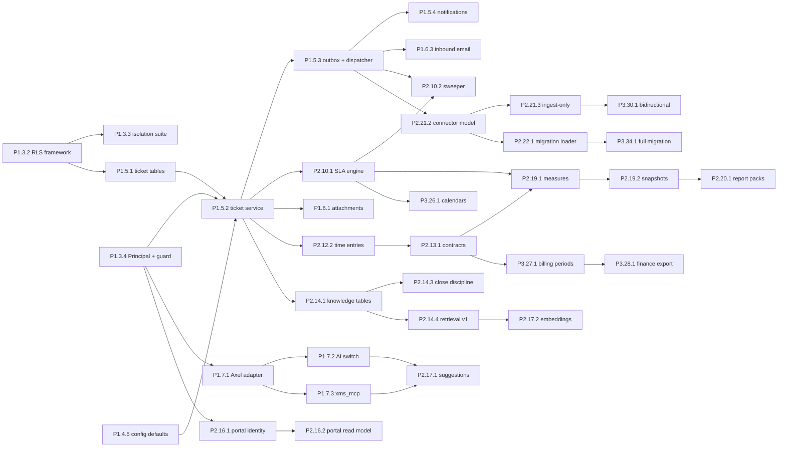

# Implementation Plan: XMS, ordered work breakdown

**Status:** Draft, built for Path 1 (six-month ServiceNow extension, current team fully dedicated); the first month is re-sequenced by the [Thirty-Day Build](./THIRTY-DAY-BUILD.md) (ADR-15), which references these item ids
**Owner:** Matt Brown
**Last updated:** 2026-09-04
**Related:** [Roadmap](./ROADMAP.md), [TODO](./TODO.md), [Test Strategy](./TEST-STRATEGY.md), [Architecture](../01-architecture/ARCHITECTURE.md), [User Experience](../01-architecture/USER-EXPERIENCE.md), [Decision Log](../00-overview/DECISION-LOG.md)

This is the build order. The [TODO](./TODO.md) is the durable checklist; this document is the detailed sequence behind it: what gets built, in what order, why that order, what each step depends on, and what proves it done. Every item is an outcome, not an activity, and carries the spec section that defines it and the test that closes it.

---

## 1. How to read this plan

**Item format.** `P<phase>.<sprint>.<n>` followed by the outcome, then four lines: **Depends on** (item ids), **Spec** (document and section), **Owner** (stream), **Done when** (the verifiable condition, usually a test). The requirement IDs from the register appear in brackets where an item closes one.

**Streams.** `INF` infrastructure and pipeline; `BE` backend (API and worker); `FE` frontend (internal and portal); `AI` Axel adapter, `xms_mcp` and harness requests; `DATA` migration and ServiceNow. Owners map to the [Roadmap §4](./ROADMAP.md) team: Developer A (tickets, SLA, state machines, portal), Developer B (time, contracts, capacity, reporting), Developer C (email, connectors, ServiceNow, migration, worker platform), Vini (Brookfield mappings, extraction, reconciliation), Matt (architecture, Axel, security, pipeline).

**Sequencing rules (apply to every sprint).**

1. Order within a feature is always migration, then worker, then API, then frontend, so an older frontend never meets a newer API it cannot read.
2. Nothing merges without its test line green in the pipeline gate; nothing deploys without the isolation suite green.
3. Foundations are horizontal (platform first). From Phase 2 on, work is vertical slices: one capability from table to screen per item, so every sprint ends with something a consultant can use.
4. A slice that touches a shared contract (state machine, permission catalog, outbox event types, RTK base API) lands the contract change first as its own item.
5. Two developers never edit the same module in the same sprint; the stream owner is the reviewer for changes to their stream.
6. Weekly sprints with fixed objectives (assessment mitigation); each sprint below names its exit demo.
7. Every item is built under the security definition of done (ADR-16, the `xms-security-first` skill): threat note first, controls before features, the required tests before the code, the completed checklist on the pull request, and the evidence artefacts in [Security Assurance](../01-architecture/SECURITY-ASSURANCE.md) kept intact. No phase gate is signed with an open security finding.

**Phase gates.** A phase ends only when its exit criterion in the [Roadmap](./ROADMAP.md) is met and the gate checklist in §8 is signed.

## 2. Phase 0: preparation (week 0, 2026-09-07 to 2026-09-13)

- **P0.0.1** Leadership path decision recorded (Path 1 default) and the team dedication confirmed. **Depends on** nothing. **Spec** Roadmap §1. **Owner** Matt. **Done when** the decision and names are in ADR-01's status line.
- **P0.0.2** Access provisioned: AWS dev and prod accounts (deploy roles, ECR), Azure DevOps project `XMS` with the ARM64 pool, Clerk dashboard access, harness dev environment, SES sandbox lifted for the dev domain. **Depends on** P0.0.1. **Owner** INF. **Done when** each developer can run `aws sts get-caller-identity` with the dev deploy role and push to the ADO repo.
- **P0.0.3** Domains and certificates: `xms.dev.<domain>`, `portal.dev.<domain>`, `mail.dev.<domain>` (SES inbound MX), and the prod equivalents reserved. **Depends on** P0.0.2. **Owner** INF. **Done when** ACM certificates are issued and MX records for the dev mail domain point at SES.
- **P0.0.4** Clerk application `XMS` created with the internal organisation and the THG enterprise connection; the `agents` JWT template with the `aud` claim defined; licensing spike scheduled (Brayan). **Depends on** P0.0.2. **Spec** Security §2.1. **Owner** Matt. **Done when** an internal user can sign in to a Clerk hosted page and the token carries `org_slug`.
- **P0.0.5** Requests sent to the Axel owners for harness changes 1, 5 and 6 (bearer context variable, inline agent registrations, sentinel confirmation). **Depends on** nothing. **Spec** AI Integration §8. **Owner** Matt. **Done when** the requests are ticketed with owners and dates.
- **P0.0.6** DMS clarification session held: pilot account chosen, one infrastructure workflow chosen, workbook reconciled and the register regenerated. **Depends on** nothing. **Spec** ADR-00. **Owner** Matt with Sofi. **Done when** `requirements.csv` carries the reconciled rows and the RTM is regenerated.
- **P0.0.7** Brookfield documentation request to Vini (flows, tables, auth, volumes, ownership) with the ingest-only assumption stated. **Owner** DATA. **Done when** the questions are answered or defaulted in the ServiceNow Sync spec §8.

## 3. Phase 1: Foundations (weeks 1 to 8)

### Sprint 1 (week 1): repositories, tooling, local environment

- **P1.1.1** `backend/` NestJS scaffold: strict TypeScript, ESLint and Prettier, Jest with Testcontainers, `pnpm` with a frozen lockfile, typed config module, `main.ts` and `src/worker/main.ts` entrypoints, global `ValidationPipe` (whitelist, forbid non-whitelisted, transform), Helmet, URI versioning `v1`, Swagger document exported to `openapi.json` at build. **Depends on** P0.0.2. **Spec** Architecture §2, Security §9, AIX Pattern Reuse §2 (validation pipe, versioning). **Owner** BE (Matt). **Done when** `pnpm lint && pnpm typecheck && pnpm test` pass on an empty app and `openapi.json` is produced.
- **P1.1.2** `frontend/` Next.js scaffold: App Router with `(internal)` and `(portal)` route groups, TypeScript strict, ESLint, Vitest with Testing Library, Playwright, Tailwind, `next.config` with the enforcing CSP and no suppression flags, a lint rule that fails on `ignoreBuildErrors`. **Depends on** P0.0.2. **Spec** Design System §2, AIX Pattern Reuse §3. **Owner** FE (Developer A). **Done when** `pnpm build` fails on an injected type error and passes clean.
- **P1.1.3** Design tokens seeded: `frontend/styles/tokens/aiinnovation-tokens.css` (vendored), `house.css`, `xms-scope.css` with `.xms-scope` on the root layout, Tailwind preset with `xms.*` and `aiinds.*`, fonts wired, `next-themes` dark mode. **Depends on** P1.1.2. **Spec** Design System §2, §3. **Owner** FE. **Done when** a token page renders the palette in light and dark and a snapshot test pins the CSS variables.
- **P1.1.4** OpenAPI type generation: `frontend` script that generates `src/api-types` from `backend/openapi.json`; a pipeline check that fails when the generated types are stale. **Depends on** P1.1.1, P1.1.2. **Spec** ADR-14. **Owner** FE. **Done when** a changed DTO breaks the frontend build until regenerated.
- **P1.1.5** Local environment: `docker-compose` with PostgreSQL 16 plus pgvector, LocalStack (S3, SQS, SES stub), MailHog, the ServiceNow stand-in placeholder; `pnpm dev` for both apps; seed command skeleton. **Depends on** P1.1.1. **Spec** Architecture §5, Test Strategy §4. **Owner** BE (Developer C). **Done when** a new developer runs both apps against local services in under 30 minutes following the README.
- **P1.1.6** `infra/` Terraform skeleton: remote state, workspaces `dev` and `prod`, provider pinning, module layout (network, ecs, rds, s3, sqs, ses, secrets, alb, alarms), `terraform plan` in the pipeline on pull request. **Depends on** P0.0.2. **Spec** Platform §1, §3. **Owner** INF (Matt). **Done when** `terraform plan` runs green for `dev` with no resources yet.
- **P1.1.7** Azure DevOps pipeline v1: one YAML with path filters for `frontend/`, `backend/`, `infra/`; gate stage (install, lint, typecheck, unit); build and push stage to the shared ECR; branch-selected deploy stage (`dev`, `production`) that calls `terraform apply` with the image tags. **Depends on** P1.1.1, P1.1.2, P1.1.6. **Spec** Platform §3. **Owner** INF. **Done when** a merge to `dev` builds `xms-web`, `xms-api` and `xms-worker` images and tags them.
- **Exit demo:** hello-world images built by the pipeline; local stack up; tokens page in both themes.

### Sprint 2 (week 2): dev environment stood up

- **P1.2.1** Terraform `dev`: ECS cluster use, four services (`xms-web`, `xms-api`, `xms-worker`, placeholder `xms-mcp`), ALB with host routing for `xms.dev` and `portal.dev`, WAF on the portal listener, RDS PostgreSQL 16 (single AZ in dev) with pgvector, parameter group, four database roles created by a bootstrap task. **Depends on** P1.1.6. **Spec** Platform §1, Data Model §2. **Owner** INF. **Done when** `https://xms.dev.<domain>/readyz` returns the API readiness JSON.
- **P1.2.2** Terraform `dev`: S3 bucket (versioning, account-prefix policy, lifecycle rules), GuardDuty Malware Protection for S3 enabled, SQS queues and DLQs per connector type with redrive policies, SES inbound receipt rule to S3 and SQS, SES sending identity for the dev domain with DKIM. **Depends on** P1.2.1. **Spec** Platform §1, Security §6, Integration Patterns §2. **Owner** INF. **Done when** an email to `intake@mail.dev.<domain>` lands as an object in S3 and a message in the inbound queue.
- **P1.2.3** Secrets Manager entries and task definition `secrets[]` for database URLs per role, Clerk keys, harness base URL and session secret placeholder, SES config; no secret in any image or `NEXT_PUBLIC_*`. **Depends on** P1.2.1. **Spec** Platform §4. **Owner** INF. **Done when** the API boots in dev reading every secret from the task definition and a repository scan finds no secret literal.
- **P1.2.4** Observability baseline: `pino` with request id and trace id, OpenTelemetry Node SDK exporting through the ADOT sidecar to X-Ray, CloudWatch log groups with retention, `/healthz` and `/readyz` on API and worker (readiness pings PostgreSQL, S3, SQS), first alarms (ALB 5xx, readiness failing). **Depends on** P1.1.1, P1.2.1. **Spec** Platform §5. **Owner** BE (Matt). **Done when** one request appears as a trace in X-Ray with its log lines correlated by trace id.
- **P1.2.5** Migration runner: Drizzle SQL migrations in `backend/src/db/migrations`, a one-off ECS task with the `dms_migrator` role invoked by the pipeline before the worker rolls, expand-migrate-contract rule documented in the migration README. **Depends on** P1.2.1. **Spec** Data Model §6. **Owner** BE. **Done when** migration 0001 (extensions and the four schemas) applies in dev from the pipeline.
- **Exit demo:** the pipeline deploys both apps to dev; an email lands in S3 and SQS; a trace shows in X-Ray.

### Sprint 3 (week 3): data layer, isolation, identity

- **P1.3.1** Schema 0002: `op.accounts` with isolation tier and residency, `op.users`, `op.roles`, `op.role_permissions`, `op.role_assignments`, `op.account_grants`, `op.assignment_groups`, `op.group_members`, `op.api_clients`, `op.api_client_grants`, `op.config_defaults`, `op.holiday_calendars`, `op.holidays`. **Depends on** P1.2.5. **Spec** Accounts & Administration technical §2. **Owner** BE (Developer A). **Done when** the migration applies from empty and rolls back on a fresh database.
- **P1.3.2** RLS framework: `acct.account_settings` as the first account-scoped table; `FORCE ROW LEVEL SECURITY` and the two policies; the repository base class that opens a transaction and runs `SET LOCAL xms.account_ids` (or `xms.account_id` for portal) from the Principal; a connection pool per database role; the `dedicated` tier connection resolver stubbed to the shared database. **Depends on** P1.3.1. **Spec** Data Model §3, Security §4. **Owner** BE (Matt). **Done when** a query without the wrapper returns zero rows and a query with two granted accounts returns exactly their rows.
- **P1.3.3** Isolation suite generator: introspects `information_schema` for every table with `account_id`, generates the cross-account read, update, delete and insert tests under `backend/test/isolation`, runs with both `dms_app` and `dms_portal` roles, fails when a table lacks RLS. **Depends on** P1.3.2. **Spec** Test Strategy §3. **Owner** BE (Matt). **Done when** adding a table without policies fails the pipeline gate.
- **P1.3.4** Principal and guard: Clerk JWT verification once per request with `authorizedParties` and the 60-second skew, harness session token as a second token type, API client keys (prefix, SHA-256 lookup, bcrypt confirm, scopes); one `Principal` with kind, user, account ids and the transitive permission set; global permission guard with `@Public()` opt-out and realm separation (portal tokens only on portal routes). **Depends on** P1.3.1. **Spec** Security §2.2, §2.3, §3. **Owner** BE (Matt). **Done when** the auth rejection suite passes: anonymous 401, garbage 401, portal token on internal route 403, missing account grant 404, wrong `aud` on a non-Axel route 401.
- **P1.3.5** Permission catalog in `backend/src/contracts` (operator and portal catalogs, transitive implications), route-and-permission snapshot test that fails on an undeclared route or a key outside the catalog. **Depends on** P1.3.4. **Spec** Security §3. **Owner** BE. **Done when** the golden snapshot file lists every route with its permission and a new route without one fails the build.
- **P1.3.6** Audit events: `acct.audit_events` (monthly partitions, append-only trigger), the audit writer used by every service, the transaction-local audit guard trigger on the protected tables, correlation id propagation from the request. **Depends on** P1.3.2. **Spec** Ticket Management technical §2 (audit), Security §7. **Owner** BE (Developer A). **Done when** an update on a protected table without an audit event in the same transaction is rejected, and an update or delete on `audit_events` raises.
- **P1.3.7** Bootstrap: `POST /v1/bootstrap` gated on configured emails and an empty administrator set; seed command for the dev accounts, groups, roles and users. **Depends on** P1.3.4. **Spec** Accounts & Administration technical §3. **Owner** BE. **Done when** a fresh dev database yields a signed-in administrator through the documented steps only.
- **P1.3.8** Security events: `sys.security_events` (monthly partitions, append-only trigger), the typed event catalog skeleton in `contracts/events.ts`, guard and data-layer hooks emitting `auth.*` and `authz.*` including `authz.isolation.filtered` from the by-id existence check. **Depends on** P1.3.4, P1.3.2. **Spec** Audit & Analytics §4.1, §5.1. **Owner** BE (Matt). **Done when** the auth rejection suite also asserts one security event per rejection and the isolation suite asserts an `authz.isolation.filtered` row for a cross-account probe. [XA-01]
- **Exit demo:** an internal user signs in, the API returns their Principal, the isolation suite is green in the pipeline.

### Sprint 4 (week 4): application shells and administration

- **P1.4.1** Frontend shell per Wireframes v2 §2: Clerk provider and sign-in, the navy finder bar (All, Favourites, History, centre workspace pill with star, global search, Axel, notifications, avatar), the finder overlay, the pinned sidebar with starred views and "Browse all screens" filtered by permissions (fail closed), the content header bar with screen switcher and filter pills, command palette, RTK Query base API with the Clerk bearer and a `me` endpoint, skeleton components, empty-state banner component. **Depends on** P1.1.3, P1.3.4. **Spec** Wireframes v2 §2, User Experience §2 and §11, Design System §8. **Owner** FE (Developer A). **Done when** a user with no permissions sees an empty sidebar and an administrator sees every section, verified by a Vitest test on the sidebar filter and a Playwright sign-in test.
- **P1.4.2** House composition components per Wireframes v2 §6: `DenseTable` in a Count card (sticky header, no striping, row and cell hover, mono `KeyLink` and `SlaValue`), `FilterPill`, `BreadcrumbTrail`, `Panel`, `TabBar`, `ScoreTile`, `MeterBar` with pause segments, `RailCard`, `RecordForm` (label-left, commit on blur with optimistic rollback), `StatePill`, `PriorityPill`, `ActorChip`, `ConditionBuilder`, `BriefLine`, `NudgeCard`, `DispatchCard`, `CloseDisciplineChecklist`, `SuggestionCard`, `ToolCallRow`, and from v3 `FilterChip`, `AddFilterButton`, `ClearAllLink`, `SelectionBar` with `BulkAction`, `TableFooter` with `RowsPerPage`, `TypeBar`, `AccountDot`. **Depends on** P1.1.3. **Spec** Wireframes v2 and v3 §4, §6 and §8, Design System §8, User Experience §3.2. **Owner** FE (Developer A). **Done when** each has a Vitest render test and the table and condition builder have interaction tests.
- **P1.4.3** Accounts API and screens (basic): account list and record (Overview and Settings tabs only), create account, isolation tier and residency fields, account settings with the AI switch stored (enforcement lands in P1.7.2). **Depends on** P1.3.1, P1.4.2. **Spec** Accounts & Administration functional §5, technical §4. **Owner** BE then FE (Developer B). **Done when** an administrator creates an account and edits its settings, and a non-administrator gets 403 on the same routes.
- **P1.4.4** Users, roles and groups API and screens: Clerk invitation through the Backend SDK with the signed webhook, role assignment, account grants with reconcile-whole-set semantics, assignment groups with members. **Depends on** P1.3.5, P1.4.2. **Spec** Accounts & Administration technical §3, §4; User Experience §3.12. **Owner** BE then FE (Developer B). **Done when** inviting a user creates the `op.users` row on webhook, grants change the Principal's account set on the next request, and removing the last administrator is refused. [TM-08, INT-01]
- **P1.4.5** Configuration defaults API (read only this sprint): state machine defaults for the five types, priority matrix, SLA policy defaults, activity types, billable classes, resolution codes loaded from versioned seed JSON into `op.config_defaults`; `ConfigResolver` merging account overrides (overrides table lands with P2.9.1). **Depends on** P1.3.1. **Spec** Accounts & Administration technical §2, Ticket Management functional §5.2 (state tables). **Owner** BE (Developer A). **Done when** the resolver returns the Incident machine for a new account and a unit test pins every default transition.
- **Exit demo:** administrator invites a user, assigns roles and account grants, and creates the pilot account.

### Sprint 5 (week 5): first ticket, audit, outbox

- **P1.5.1** Schema 0003: `acct.tickets` (all columns including SLA and resolution blocks, `version`, `tsvector`), `acct.comments`, `acct.work_notes`, `acct.watchers`, `acct.notifications`, the `CS` sequence, partial indexes. **Depends on** P1.3.2. **Spec** Ticket Management technical §2. **Owner** BE (Developer A). **Done when** the isolation suite covers the new tables and the portal role has no grant on `work_notes`.
- **P1.5.2** Ticket service (minimal): create with derived priority from the default matrix, list with filters and pagination, get, patch properties with optimistic version, the transitions endpoint validating against the resolved state machine (no SLA effects yet), comments and work notes creation, audit events for everything, actor stamping from the Principal. **Depends on** P1.5.1, P1.4.5, P1.3.6. **Spec** Ticket Management technical §3, §4. **Owner** BE (Developer A). **Done when** the state machine unit suite passes for all five types (every allowed and forbidden transition) and a concurrent patch with a stale version returns 409.
- **P1.5.3** Outbox and dispatcher: `sys.outbox`, the transactional outbox writer used by the ticket service, the worker dispatcher claiming rows with `SKIP LOCKED`, fan-out to SQS by subscription, `sys.inbox`, `sys.dead_letters`, `sys.job_leases`, the retry classification helper. **Depends on** P1.2.2, P1.5.1. **Spec** Integration Patterns §2, §3. **Owner** BE (Developer C). **Done when** an outbox row written in a rolled-back transaction never dispatches, a dispatched row is idempotent on redelivery, and a poisoned message reaches the DLQ after five attempts (chaos test against LocalStack).
- **P1.5.4** Notifications: `acct.notifications` writer subscribed to outbox events (assigned, mention, comment on my ticket), the feed endpoint with unread count and collapse keys, mark read, per-type mute. **Depends on** P1.5.3. **Spec** Ticket Management technical §3 (notifications), AIX Pattern Reuse §1 (notification triad). **Owner** BE (Developer C). **Done when** assigning a ticket produces exactly one unread row for the assignee and a second assignment collapses into it.
- **P1.5.5** Frontend: Queue (system views only, no condition builder yet), New ticket record form, Ticket record with Properties, Conversation (public reply and work note composer) and Activity tabs, state pill transition menu, notifications bell with 60-second polling, optimistic transition with 409 rollback toast. **Depends on** P1.5.2, P1.4.2, P1.1.4. **Spec** User Experience §3.2 to §3.4. **Owner** FE (Developer A). **Done when** the Playwright golden path "create a ticket, reply publicly, add a work note, move to In progress" passes against dev and the work note never appears in the portal role's timeline view.
- **P1.5.6** Usage events: `rpt.usage_events`, the API request middleware with the buffered writer, the `telemetry` queue and `POST /v1/telemetry` ingestion (catalog validation, server stamping, grant filtering, rate limit), the frontend telemetry client (batching, keepalive flush, screen ids from the route registry, `useTrack`, search and error events, account setting and role rules). **Depends on** P1.5.3, P1.4.1, P1.3.8. **Spec** Audit & Analytics §4.2, §5. **Owner** BE (Developer C) then FE (Developer A). **Done when** opening the Queue and creating a ticket produce `screen.view`, `action.completed` and `api.request` rows sharing one request id, and a client-supplied account id outside the grants is dropped. [XA-02]
- **Exit demo:** a consultant creates and works a ticket end to end in dev; the audit trail reads as a story.

### Sprint 6 (week 6): attachments and email plumbing

- **P1.6.1** Attachments: `acct.attachments` with scan state, presigned POST with `content-length-range` and MIME allowlist, the S3 client checksum setting, download only when `clean`, GuardDuty scan result consumer in the worker, quarantine move and notification, retention lifecycle by account. **Depends on** P1.5.1, P1.2.2. **Spec** Ticket Management technical §3 (attachments), Security §6. **Owner** BE (Developer C). **Done when** an EICAR test object is quarantined within the scan window and its download returns 403, while a clean object downloads. [TM-14]
- **P1.6.2** Attachments UI: drop zone on New ticket and the record, scan state chips, quarantined placeholder, download. **Depends on** P1.6.1. **Owner** FE (Developer A). **Done when** the golden path uploads a file and shows it as clean.
- **P1.6.3** Inbound email pipeline: `acct.inbound_aliases`, `acct.inbound_messages`, `acct.quarantine_items`; the worker consumer for the SES queue parsing MIME (mailparser), header extraction, alias to account resolution, sender to contact resolution, the thread-matching precedence (plus-address token, In-Reply-To, References, subject key), append-or-create through the ticket service with origin `email`, unknown sender to quarantine, raw message retained in S3. **Depends on** P1.5.3, P1.2.2. **Spec** Email Intake technical §2, §3. **Owner** BE (Developer C). **Done when** the email corpus tests pass (Outlook, Gmail, Apple Mail, ServiceNow notification, reply to a known key, unknown sender) and a reply appends instead of duplicating. [EM-01, EM-02, EM-03]
- **P1.6.4** Outbound email: `acct.outbound_messages`, SES v2 sender in the worker with in-repo MJML templates typed against client-visible view models, per-account branding and sending identity, stable `[CS...]` subject key, `Message-ID` and `References` threading, bounce and complaint handling by SNS, suppression list. **Depends on** P1.5.3. **Spec** Email Intake technical §3, §5. **Owner** BE (Developer C). **Done when** a public reply produces one outbound message whose headers thread under the original in MailHog, and a template referencing a work-note type fails to compile. [EM-08]
- **P1.6.5** Quarantine screen and alias administration on the account record; raw email view on email-originated comments. **Depends on** P1.6.3. **Spec** User Experience §3.6. **Owner** FE (Developer A). **Done when** a reviewer turns a quarantined message into a contact and a ticket in one action.
- **Exit demo:** an email to the pilot alias becomes a ticket; the consultant's reply reaches MailHog correctly threaded.

### Sprint 7 (week 7): Axel adapter skeleton and MCP module

- **P1.7.1** Axel adapter module in `backend/src/axel`: session token exchange with the harness and per-user cache, the interactive SSE relay for `POST /v1/axel/turns` (stream id capture, cancel, detach), explicit `Origin` header, `opportunity_id = solution:xms`, typed `unavailable` and `withheld` results, contract tests against recorded harness fixtures. **Depends on** P1.3.4, P0.0.5. **Spec** AI Integration §2, §3, §7. **Owner** AI (Matt). **Done when** a recorded harness stream replays through the adapter into an SSE client and a 422 from the harness surfaces as `unavailable` with the body logged.
- **P1.7.2** AI switch enforcement: `acct.ai_settings`, `acct.ai_suggestions`, `acct.ai_suggestion_decisions`, `acct.ai_feedback`; adapter pre-flight (switch, capability opt-in, permission); the RLS `WITH CHECK` policy that refuses suggestion rows for disabled accounts; the disable cascade. **Depends on** P1.7.1, P1.4.3. **Spec** AI Functionality technical §2, §5; Security §8. **Owner** AI (Matt). **Done when** with the switch off no HTTP call leaves the adapter (asserted with a mocked transport) and an insert into `ai_suggestions` for that account is rejected by the database. [AI-08, AI-10, AI-11]
- **P1.7.3** `xms_mcp` module in `aix-mcp`: `make_mcp("xms")`, auth middleware validating the harness session token, the `current_bearer` forwarding (harness change 1), read tools `get_ticket`, `list_tickets`, `get_ticket_thread` calling the XMS API as the caller; catalog row with `useCallerToken`; registered in the harness `McpServer` catalog for dev. **Depends on** P1.7.1, P1.5.2. **Spec** AI Integration §4. **Owner** AI (Matt). **Done when** a harness agent turn lists the caller's tickets and a user without a grant on an account gets no rows through the tool.
- **P1.7.4** Frontend Axel panel over a small streaming client in `frontend/lib/axel-client` (line buffer carry, heartbeat skip, chunk union subset), docked and resizable, cancel on close, detach on navigation; `xms-desk-assistant` inline agent registered in the harness (harness change 5) with the MCP server enabled. **Depends on** P1.7.1, P1.7.3. **Spec** AI Integration §3, User Experience §3.13. **Owner** FE (Developer A) with AI. **Done when** a consultant asks "what is on my queue" and the answer cites real ticket keys from dev.
- **P1.7.5** Alarms and runbooks v0: DLQ depth, outbox lag, queue age, readiness, SES failures; runbooks for deploy and rollback, DLQ replay, email loop severity-1, secrets rotation. **Depends on** P1.2.4, P1.5.3. **Spec** Platform §5, §8. **Owner** INF. **Done when** a synthetic DLQ message triggers the alarm to the team channel.
- **P1.7.6** Event archive and tamper evidence: nightly Parquet export of the three streams to the Object Lock bucket, chained daily digests, `integrity.*` events, ingestion-lag and buffer-overflow alarms, retention partition detach job. **Depends on** P1.5.6, P1.2.2. **Spec** Audit & Analytics §6. **Owner** INF (Matt). **Done when** a modified archived row is detected by the verification job in dev and raises the alarm. [XA-04]
- **Exit demo:** the Axel panel answers about real tickets; turning the account's AI switch off makes the panel report "AI is disabled for this account".

### Sprint 8 (week 8): hardening and Phase 1 exit

- **P1.8.1** Auth and isolation hardening pass: dependency audit in the gate, ZAP baseline against `xms.dev` and `portal.dev` (sign-in page only for now), rate limiting on webhook and portal routes, CORS allowlist, CSP verified with the CSP report endpoint. **Depends on** all Sprint 3 to 7 items. **Spec** Security §9. **Owner** Matt. **Done when** ZAP reports no high findings and the audit has no known-vulnerable dependency.
- **P1.8.2** Load baseline: k6 script for the ticket list at 50k seeded tickets on one account, p95 under 500 ms in dev. **Depends on** P1.5.2. **Spec** Test Strategy §2. **Owner** BE. **Done when** the k6 run is stored as the baseline artifact.
- **P1.8.3** Seed and demo data: two fictional accounts with contrasting calendars, one internal team across three groups, 200 tickets across states, email fixtures. **Depends on** P1.5.2, P1.6.3. **Spec** Test Strategy §4. **Owner** BE. **Done when** `pnpm seed:dev` produces the data set in under two minutes and e2e uses it.
- **P1.8.4** Phase 1 exit review against the Roadmap criterion: a ticket created by hand and by email, audit and isolation and AV tests green in the pipeline, runbooks present. **Owner** Matt. **Done when** the gate checklist in §8 is signed.

## 4. Phase 2: Focused pilot (weeks 9 to 25)

### Sprint 9 (week 9): state machines and priority as configuration

- **P2.9.1** `acct.config_overrides` and the configuration editor API: state machine versions per type with required fields, SLA effects and billing treatment; priority matrix override; validation that every transition is reachable and every terminal state is reachable; "affects new tickets only" semantics via the version stamped on the ticket. **Depends on** P1.4.5. **Spec** Accounts & Administration technical §2, Ticket Management technical §3. **Owner** BE (Developer A). **Done when** an override that removes a transition in use is rejected with the offending state named, and tickets created before an override keep their machine. [TM-02, TM-03, TM-04]
- **P2.9.2** Configuration screens: state machine editor with graph preview, priority matrix grid, SLA policy defaults, catalogs (activity types, billable classes, resolution codes), holiday library. **Depends on** P2.9.1. **Spec** User Experience §3.12. **Owner** FE (Developer B). **Done when** an administrator adds a state and transition and the transition menu on a new ticket shows it.
- **Exit demo:** the pilot account's Incident machine edited without a deploy.

### Sprint 10 (week 10): SLA engine (wall-clock calendar) and sweeper

- **P2.10.1** SLA engine in `backend/src/domain/sla`: policy resolution (type, priority, contract), `acct.sla_clocks` and `acct.sla_pauses`, business-minute math over a calendar interface (a 24x7 calendar this sprint), stamp at create, response met on first public reply by an internal actor or first In progress, pause on configured states with reason evidence, resume with excluded minutes, latch-before-pause and resume-then-latch ordering, priority change restamping from the change moment, reopen keeps latches. **Depends on** P1.5.2. **Spec** Ticket Management technical §2 (clocks), §3 (SLA). **Owner** BE (Developer A). **Done when** the SLA suite reaches 100 percent branch coverage including the POC cases (10-minute pause shifts both due times by 600 seconds; breach cannot be rescued by pausing after the fact). [TM-05, TM-07]
- **P2.10.2** Breach sweeper in the worker: `SKIP LOCKED` batch of 500 every five minutes sharing the service's latch function, one `sla_breached` event and one notification per clock, prefilter mirrors the latch preconditions. **Depends on** P2.10.1, P1.5.3. **Spec** Ticket Management technical §3, AIX Pattern Reuse §1 (sweeper). **Owner** BE (Developer A). **Done when** an idle ticket past due latches within one sweep cycle and a second sweep produces no second event.
- **P2.10.3** SLA in the UI: `SlaBadge` on lists with 30-second ticking, SLA meters with pause segments on the record rail, Pause and Resume with reason picker, "No SLA" state, breach lock. **Depends on** P2.10.1. **Spec** User Experience §3.4, §5.3. **Owner** FE (Developer A). **Done when** `slaTime` display tests pass for remaining, paused, breached and met states and the Playwright pause flow shows the frozen meter.
- **Exit demo:** a P2 ticket's response clock runs, pauses on Awaiting client with a reason, resumes, and the breach latches when overdue.

### Sprint 11 (week 11): search, saved views, links, bulk

- **P2.11.1** Search and views API: `tsvector` search across tickets, comments and work notes (work notes excluded for portal principals), `pg_trgm` on keys and requester email, condition builder grammar to SQL translation with an allowlist of fields and operators, `acct.saved_views` (private, group, account), system views. **Depends on** P1.5.1. **Spec** Ticket Management technical §3, §4. **Owner** BE (Developer A). **Done when** a condition set round-trips through the URL and the SQL translation has property tests for every operator. [TM-15]
- **P2.11.2** Links and groups: `acct.ticket_links` with inverse implied, `acct.ticket_groups` and members, duplicate-of behaviour (comments on the duplicate mirror to the primary as work notes). **Depends on** P1.5.1. **Spec** Ticket Management technical §2, §3. **Owner** BE (Developer A). **Done when** linking A blocks B forbids B from resolving until A resolves, and a cycle is rejected. [TM-09]
- **P2.11.3** Bulk actions with one audit event per record, in a worker job for sets over 50. **Depends on** P1.5.2, P1.5.3. **Owner** BE. **Done when** a bulk assign of 500 tickets writes 500 audit events and one notification per assignee. [TM-16]
- **P2.11.4** Queue complete: condition builder, saved views with sidebar badges, column chooser, multi-select and bulk actions, export to Excel and CSV (server-side generation over 5,000 rows), global search omnibox with grouped results, Links tab on the record. **Depends on** P2.11.1 to P2.11.3, P1.4.2. **Spec** User Experience §3.2, §2.2. **Owner** FE (Developer A). **Done when** the Playwright flow builds a three-condition view, saves it, reloads it from the URL and exports it. [DR-06]
- **P2.11.5** Audit search screen over `rpt.events_v` with the condition builder, record drawer, "Show this request" pivot, saved queries and export (which itself emits `data.export.produced`); `audit:read` and `audit:export` permissions. **Depends on** P2.11.1, P1.5.6. **Spec** Audit & Analytics §7.1, User Experience §3.12. **Owner** FE (Developer A) with BE. **Done when** an administrator finds every event of one request id across the three streams from one search. [XA-03]
- **Exit demo:** the dispatcher's "Breached on Brookfield" saved view with an Excel export.

### Sprint 12 (week 12): dispatch, roster, time entries

- **P2.12.1** Roster: `op.people`, `op.skills`, `op.person_skills`, `op.certifications`, `op.person_calendars`; roster API and screens (list and record, rates visible only with the finance permission). **Depends on** P1.4.4. **Spec** Capacity & Allocation technical §2, §4. **Owner** BE then FE (Developer B). **Done when** a person record round-trips and a consultant without the finance permission receives DTOs with no rate fields. [CAP-01]
- **P2.12.2** Time entries: `acct.time_entries` (append-only), `acct.time_adjustments`, `acct.non_ticket_buckets` (table only), activity types with default billable class, rate snapshot stubbed to the contract card (P2.13.1 fills it), after-hours flag from the account calendar (24x7 until Phase 3), per-ticket breakdown endpoint with Excel export, delete-own replaced by adjustment. **Depends on** P1.5.1, P2.12.1. **Spec** Time, Contracts & Budget technical §2, §3. **Owner** BE (Developer B). **Done when** an entry cannot be updated or deleted, an adjustment links to it, and the per-ticket breakdown sums by person, role, date and activity type. [TB-01, TB-03, TB-04, TB-10]
- **P2.12.3** Mandatory time before resolution: the Resolve transition rule requiring logged time or an exemption reason; exemption reasons catalog. **Depends on** P2.12.2, P2.9.1. **Spec** Ticket Management technical §3, Time & Budget functional §5. **Owner** BE (Developer A). **Done when** resolving a ticket with zero minutes and no exemption returns a typed 409 naming the rule. [TB-02]
- **P2.12.4** Dispatch screen with inline group and assignee pickers, "assign to me", sidebar count badge; Time tab on the record with the five-second entry path and the `t` shortcut; My Work with the Time today card (nudge lands in P2.18.3). **Depends on** P2.12.2, P2.12.3. **Spec** User Experience §3.1, §3.4, §3.5. **Owner** FE (Developer A). **Done when** the Playwright flow assigns from Dispatch and logs 30 minutes from the record in under three interactions. [TM-08]
- **Exit demo:** dispatcher routes the morning's tickets; a consultant logs time and is blocked from resolving without it.

### Sprint 13 (week 13): contracts and consumption

- **P2.13.1** Contracts: `acct.engagements`, `acct.contracts` (retainer, prepaid block, T&M, fixed fee), `acct.contract_periods` with consumed minutes maintained transactionally and a nightly assertion, rollover rules (none, carry month, carry term, cap) computed at period open, overage rules (block, allow with flag, allow at overage rate) with the boundary split, `acct.rate_cards` and entries (effective-dated, contract then account precedence), rate snapshot on entries, SLA policy per contract. **Depends on** P2.12.2. **Spec** Time & Budget technical §2, §3. **Owner** BE (Developer B). **Done when** the burn-down suite covers billable and non-billable across a month boundary, rollover and overage cases, and the rate snapshot picks the greatest `effective_from` on or before the entry date. [TB-05, TB-06, TB-07]
- **P2.13.2** Contract position endpoint (consumed, remaining, forecast stub) used by the ticket rail, the account record and later the portal. **Depends on** P2.13.1. **Owner** BE. **Done when** the rail shows the same numbers as the account record for the same period (one service, asserted by a test).
- **P2.13.3** Contracts screens on the account record: list, record with model, periods, rollover and overage, rate card versions, SLA policy grid, burn chart; contract card on the ticket rail; contract picker on New ticket with hours remaining and expiry warnings. **Depends on** P2.13.2. **Spec** User Experience §3.9, §3.3. **Owner** FE (Developer B). **Done when** creating a retainer with a policy grid stamps SLA targets on the next ticket and the rail shows burn after logging time.
- **Exit demo:** the pilot account's retainer shows burn after a morning of logged time.

### Sprint 14 (week 14): knowledge base core

- **P2.14.1** Knowledge tables: `acct.solution_articles`, `acct.article_versions`, `acct.article_visibility`, `acct.article_feedback`, `acct.configuration_items`, `acct.ci_links`, `acct.ticket_solutions`, `acct.ticket_templates`, `acct.embeddings` (empty until P2.17.2); the reserved `GLOBAL` account row; `acct.article_visible()` and its policy; `KB` sequence. **Depends on** P1.3.2. **Spec** Knowledge Base technical §2. **Owner** BE (Developer B). **Done when** the isolation suite proves a portal principal sees only published articles visible to their account and a global article is visible to every account.
- **P2.14.2** Article lifecycle service: create from a resolved ticket (resolution notes pre-filled), draft, in review, publish (immutable version), retire, generalise (new global article linked by `generalised_from_id`, identifier checklist must be clean), feedback, usage counters, CI CRUD, templates CRUD. **Depends on** P2.14.1. **Spec** Knowledge Base technical §3. **Owner** BE (Developer B). **Done when** publishing with an identifier finding is rejected and a ticket linked to version 2 still shows version 2 after version 3 publishes. [CP-08, TM-17, TM-19]
- **P2.14.3** Close discipline: the Resolve transition rule requiring a resolution code and, for solution codes, a `ticket_solutions` row (resolved by, partially resolved by, created from) unless a no-solution code. **Depends on** P2.14.2, P2.9.1. **Spec** Knowledge Base functional §5, ADR-05. **Owner** BE (Developer A). **Done when** resolving with "Solution provided" and no link returns the typed 409 and resolving with "Duplicate" succeeds without one.
- **P2.14.4** Hybrid retrieval v1: full-text plus trigram search over articles and resolved ticket summaries scoped by account, ranked by reciprocal rank fusion; the `search_solutions` and `find_similar_tickets` endpoints (vector union added in P2.17.2). **Depends on** P2.14.1. **Spec** Knowledge Base technical §3. **Owner** BE (Developer B). **Done when** a seeded article about "Azure Files cutover" ranks first for a ticket titled with the same words.
- **Exit demo:** a resolved ticket becomes a draft article and is published to the account; the next similar ticket shows it in the rail.

### Sprint 15 (week 15): knowledge screens and resolution flow

- **P2.15.1** Solutions list and record (structured editor, versions, visibility editor, identifier checklist findings, generalise), Review queue with diff, Configuration items list and record, Templates editor; "Use template" on New ticket. **Depends on** P2.14.2. **Spec** User Experience §3.7. **Owner** FE (Developer B). **Done when** the Playwright flow creates an article from a resolved ticket, submits it for review, approves and publishes it.
- **P2.15.2** Resolution tab on the record: code, notes, solution link search, "Create article from this ticket", exemption reason, the close discipline checklist; Solutions rail with "Use" and "Not relevant" (feedback recorded). **Depends on** P2.14.3, P2.14.4. **Spec** User Experience §3.4. **Owner** FE (Developer A). **Done when** the golden path resolves a ticket by linking an article and the article's used-by count increments.
- **Exit demo:** the core loop from email to published solution runs in dev without leaving the record.

### Sprint 16 (week 16): portal foundations

- **P2.16.1** Portal identity: Clerk organisation per account (`acct-<key>`) created on account activation, portal user invitation flow, local fallback with mandatory MFA, portal Principal with exactly one account, realm separation on routes, `acct.contacts` linked to portal users. **Depends on** P1.3.4, P1.4.3. **Spec** Client Portal technical §3, Security §2.1. **Owner** BE (Matt). **Done when** the isolation suite with the portal role passes and a portal token on `/v1/tickets` returns 403. [CP-02]
- **P2.16.2** Portal read model and forms: `acct.ticket_timeline_public` view, `acct.ticket_forms` and versions with the shared validation schema, portal routes for my requests, organisation requests (permission), request detail, public comment, attachment upload with the same limits, portal state vocabulary mapping. **Depends on** P2.16.1, P1.6.1. **Spec** Client Portal technical §2 to §4. **Owner** BE (Developer A). **Done when** a form version is stamped on the ticket, a required field is enforced server-side, and a work note never appears in the view (asserted by a test that inserts one and queries as portal). [CP-03, CP-04, CP-05]
- **P2.16.3** Portal screens: sign-in, Home (search-first over published solutions, my requests, notices), New request (search then dynamic form), Request detail (timeline in client language, expected-by dates, thread, attachments, mark as resolved), Knowledge browse and article, account branding. **Depends on** P2.16.2, P2.14.4. **Spec** User Experience §4.1 to §4.5. **Owner** FE (Developer A). **Done when** the Playwright portal flow submits a request after a search, sees the consultant's public reply, and never sees the work note; WCAG checks pass with axe.
- **Exit demo:** an invited pilot user submits a request from the portal and gets the reply by email and on the portal.

### Sprint 17 (week 17): Axel assistive capabilities

- **P2.17.1** Suggestion lifecycle and MCP `propose_*` tools: offered, withheld (typed reason), accepted, edited then accepted, rejected, expired; decisions written in the same transaction as the domain change; `propose_classification`, `propose_priority`, `propose_duplicate`, `propose_summary` tools; the `xms-triage` inline agent (Haiku 4.5) registered in the harness; the intake trigger off outbox events, debounced. **Depends on** P1.7.2, P1.7.3, P1.5.3. **Spec** AI Functionality technical §2, §3. **Owner** AI (Matt). **Done when** a created ticket receives category, priority and duplicate suggestions within the debounce window, and a suggestion below the threshold is stored `withheld` and never returned by the offered endpoint. [AI-01, AI-02, AI-03, AI-09, AI-13]
- **P2.17.2** Embeddings and vector retrieval: worker job embedding article versions and resolved ticket summaries through the adapter (Titan exception until the harness endpoint exists), `ivfflat` index, hybrid search union by reciprocal rank fusion only when the account switch is on, the `search_solutions` MCP tool. **Depends on** P2.14.4, P1.7.2. **Spec** Knowledge Base technical §3, AI Integration §8. **Owner** AI (Matt) with Developer B. **Done when** a semantically similar article with no shared words ranks in the top three for an AI-on account and vector search is skipped for an AI-off account. [AI-07]
- **P2.17.3** Inline surfaces: category, priority and duplicate chips on New ticket and New-state records with accept and dismiss, "Summarise" above the thread, feedback capture, the Activity actor chip for AI; AI settings on the account record (switch, opt-ins, thresholds). **Depends on** P2.17.1. **Spec** User Experience §3.13, §3.9. **Owner** FE (Developer A). **Done when** accepting a chip fills the field and the Activity tab shows the AI action with the confirming user.
- **Exit demo:** a new ticket arrives with suggested category and a duplicate warning; the consultant accepts one and rejects the other; both are in the audit trail.

### Sprint 18 (week 18): email intake complete and time assistance data

- **P2.18.1** Email hardening: signature, disclaimer and quoted-reply stripping with the pattern data files and corpus, inline image extraction and re-encoding, loop guard scoring (auto-submitted headers, bulk precedence, reflected Message-ID, sender rate, subject bursts) with alias auto-disable and the severity-1 alarm, out-of-office suppression, unknown-sender review decisions (create contact, append, discard). **Depends on** P1.6.3. **Spec** Email Intake technical §3. **Owner** BE (Developer C). **Done when** the corpus asserts exact stripped output for every sample, a simulated loop disables the alias within the window, and an out-of-office never creates a ticket. [EM-04, EM-05, EM-06, EM-07]
- **P2.18.2** Quarantine screen complete (loop score, sender history, bulk discard, alias re-enable). **Depends on** P2.18.1. **Owner** FE (Developer A). **Done when** the reviewer flow covers all three decisions.
- **P2.18.3** Unlogged-time data: `GET /v1/timesheets/me/unlogged` from the person calendar versus entries; My timesheet week grid with inline entry and daily totals; My Work Time today card. **Depends on** P2.12.2. **Spec** Time & Budget technical §4, User Experience §3.8. **Owner** BE then FE (Developer B). **Done when** a day with four hours logged against an eight-hour calendar reports four unlogged hours.
- **Exit demo:** a messy Outlook reply with signature and quoted history appends as a clean comment; a loop test trips the alias.

### Sprint 19 (week 19): dashboards and exports

- **P2.19.1** Measure catalog and live measures API: the seventeen measures with definitions (breached-then-met counts as missed, MTTR excludes paused minutes, reopen window 14 days), operations aggregates per account set, account dashboard measure set, portfolio aggregates; `rpt.portal_visible_measures`. **Depends on** P2.10.1, P2.13.1. **Spec** Dashboards & Report Packs technical §2, §3. **Owner** BE (Developer B). **Done when** each measure has a unit test with constructed tickets and the dashboard endpoint returns in under 500 ms at the seeded volume. [DR-02, DR-03]
- **P2.19.2** Daily snapshots: `rpt.daily_snapshots` keyed on account, date, measure and grain, taken at the account's local midnight, idempotent, backfillable from audit events, flagged `backfill`. **Depends on** P2.19.1, P1.5.3. **Spec** Dashboards technical §3. **Owner** BE (Developer B). **Done when** running the job twice for the same day inserts nothing the second time and a backfill for the seeded history matches the live computation for that day. [DR-07]
- **P2.19.3** Screens: Operations dashboard (ink banner, scorecards that filter the Queue, panels), Account dashboard with "View as client", Exports history; 60-second polling. **Depends on** P2.19.1. **Spec** User Experience §3.11. **Owner** FE (Developer B). **Done when** clicking the Breached scorecard opens the Queue with the breached view. [DR-01]
- **P2.19.4** Security and Usage dashboards under Admin (sign-in failures, denials, isolation probes, admin timeline, exports; active users by role and account, adoption, core-loop funnel, action durations, no-result searches, Axel acceptance, portal deflection, error rate, API usage) with adoption measures added to the catalog; account-owner slices. **Depends on** P2.19.1, P1.5.6. **Spec** Audit & Analytics §7.1. **Owner** FE then BE (Developer B). **Done when** the funnel reproduces the seeded data's known drop-off and the security dashboard shows the auth rejection suite's events. [XA-03]
- **Exit demo:** the operations dashboard for the pilot account with live SLA attainment.

### Sprint 20 (week 20): basic WSR pack

- **P2.20.1** Report packs: `op.report_templates` (operator PPTX master), `acct.report_packs`, `acct.report_schedules`, `acct.report_runs`; the worker renderer (`pptxgenjs` from the template, nine slides with placeholders, PDF through headless Chromium in the worker image), measures frozen into the pack, manual "Generate now". **Depends on** P2.19.2. **Spec** Dashboards technical §3, ADR-11. **Owner** BE (Developer B). **Done when** a pack renders for the seeded account with every slide populated and the PPTX opens in PowerPoint without repair. [DR-04]
- **P2.20.2** Report pack screens: runs list with downloads, Review screen with page thumbnails and a templated narrative (Axel narrative lands in P3), "Approve" (send lands with P3.31.1). **Depends on** P2.20.1. **Spec** User Experience §3.11. **Owner** FE (Developer B). **Done when** the account owner opens the pack from the review screen.
- **Exit demo:** the pilot account's weekly pack generated from live data and downloaded.

### Sprint 21 (week 21): ServiceNow ingest-only and the stand-in

- **P2.21.1** ServiceNow stand-in: Express app implementing the Table API subset (cases, journal, attachments, dictionary) with CSM and ITSM profiles and fault injection, in docker-compose and the test kit. **Depends on** P1.1.5. **Spec** ServiceNow Sync technical §8, Integration Patterns §6. **Owner** DATA (Developer C). **Done when** contract tests run against it in the pipeline.
- **P2.21.2** Connector instance model and registry: `op.connector_types`, `acct.connector_instances` with mode, kill switch and health, `acct.field_maps` and `acct.state_maps` (versioned, validated against the dictionary and sample records, immutable once active), `acct.sync_links`, journal and attachment links, `acct.sync_runs`. **Depends on** P1.5.3. **Spec** ServiceNow Sync technical §2, §3. **Owner** DATA (Developer C). **Done when** activating a map with an unmapped required field is rejected and activation is an audit event. [SN-01, SN-02, SN-08]
- **P2.21.3** Ingest-only handler: polling on the `sys_updated_on` watermark, inbox deduplication by external id and version, translation through the maps, apply through the ticket service with origin `sync:<instance>`, journal entries to comments or work notes per configuration, attachments with size handling, health computation, sync tab data. **Depends on** P2.21.2, P2.21.1. **Spec** ServiceNow Sync technical §3. **Owner** DATA (Developer C). **Done when** a case created in the stand-in appears as a ticket with source Sync within one poll, an update applies once under redelivery, and a work note never lands as a comment. [SN-05, SN-06, SN-09]
- **P2.21.4** Connectors screens: instance record (settings, mode, kill switch, maps with validation report, runs, dead letters with replay and discard), Sync tab on the ticket, connector health overview under Admin. **Depends on** P2.21.3. **Spec** User Experience §3.9, §3.12. **Owner** FE (Developer C). **Done when** an administrator activates a validated map and replays a dead letter from the screen. [SN-07]
- **Exit demo:** a case from the stand-in becomes a ticket; the Brookfield sandbox ingest is attempted if credentials arrived.

### Sprint 22 (week 22): migration rehearsal

- **P2.22.1** Migration tables and loader: `acct.import_batches`, `acct.import_records`, `acct.reconciliation_reports`; extraction from ServiceNow exports (cases, journals split by type, attachments, users and contacts) to raw S3 rows; the loader calling the domain services with an `ImportContext` that suppresses outbox, notifications, SLA clocks and Axel; identity keyed on account, object kind and `sys_id` with a source hash; ServiceNow keys into `external_ref`; one `imported` audit event carrying the source timestamp. **Depends on** P2.21.2, P1.6.1. **Spec** Data Migration technical §2, §3. **Owner** DATA (Vini with Developer C). **Done when** a representative export loads twice with zero duplicates and the second run reports every row as skipped or updated. [DM-01]
- **P2.22.2** Migration console (batches, progress, errors) and the reconciliation report v1 (counts per object per account). **Depends on** P2.22.1. **Spec** User Experience §3.12. **Owner** FE (Developer C). **Done when** the console shows the rehearsal batch and its deltas.
- **Exit demo:** a representative slice of the pilot account's ServiceNow history in dev, searchable by the ServiceNow number.

### Sprints 23 to 25 (weeks 23 to 25): pilot hardening and beta

- **P2.23.1** e2e golden paths complete in the pipeline (create by form, create by email, work to close with time and solution, portal isolation, WSR generation, stand-in round trip); ZAP against the portal with invited users; k6 rerun. **Depends on** all Phase 2 items. **Spec** Test Strategy §2, §5. **Owner** Matt. **Done when** the pipeline runs them on every dev deploy.
- **P2.23.2** Accessibility pass on the portal (axe in Playwright, keyboard walk-through) and keyboard shortcuts on the internal app. **Owner** FE. **Done when** axe reports no serious violations on the six portal screens.
- **P2.24.1** Pilot onboarding: the pilot account configured through the screens only (calendar 24x7 for now, contract, alias, forms, invited users, AI switch), the onboarding checklist on the account Overview green. **Depends on** P2.23.1. **Spec** User Experience §5.8. **Owner** Matt with DMS. **Done when** the checklist is complete without a database edit.
- **P2.24.2** Beta start: the DMS team runs the chosen infrastructure workflow on the pilot account in XMS for two consecutive weeks; acceptance rate of Axel suggestions measured; the pilot WSR produced from XMS. **Owner** DMS with Matt. **Done when** the Roadmap Phase 2 exit criterion is met and the §8 gate is signed.
- **P2.25.1** Beta feedback triage into Phase 3 sprints; defects fixed; Phase 3 plan re-sequenced if the path decision changed. **Owner** Matt.

## 5. Phase 3: Operational replacement (weeks 26 to 44, January to June 2027)

Items are grouped by month; weekly sprint boundaries are set at the Phase 3 planning session after the beta.

### Month 1 (weeks 26 to 29): calendars, SSO, commercial completeness

- **P3.26.1** Business calendars: `acct.business_calendars`, hours with a GiST exclusion constraint, holiday library reference, effective-from, IANA zone; the pure calendar engine (business minutes between instants, next working instant); SLA clocks bound to the calendar they started on; after-hours and weekend flagging on time entries with the premium or comp-time rule per contract; calendar editor with the preview route. **Depends on** P2.10.1, P2.12.2. **Spec** Accounts & Administration technical §2, §3; Time & Budget technical §3. **Owner** BE (Developer A) then FE (Developer B). **Done when** the engine passes the UK, Brazil, Australia, Canada and US calendar cases including DST transitions and a holiday inside a pause, and an entry at 20:00 local on the account calendar is flagged after-hours. [TM-06, TB-13]
- **P3.26.2** Portal SSO: enterprise SAML and OIDC connection per account organisation in Clerk, fallback rules, SSO status on the account record and the portal Account screen, portal account admin managing users. **Depends on** P2.16.1, P0.0.4 spike result. **Spec** Client Portal technical §3. **Owner** Matt. **Done when** a test IdP (Entra test tenant) signs a portal user in and the same user cannot reach the internal host. [CP-01]
- **P3.26.3** Archive analytics and privacy jobs: Glue catalog and Athena over the event archive with analyst documentation, weekly digest verification, pseudonymisation job for erasure requests, `usage_analytics_portal` and `store_search_terms` settings honoured end to end, `analytics:read-individual` gating with its own security event. **Depends on** P1.7.6, P2.19.4. **Spec** Audit & Analytics §6, §8. **Owner** INF (Matt) with BE (Developer C). **Done when** an Athena query over a month of archived usage matches the PostgreSQL count and a pseudonymised user no longer appears by name in any stream. [XA-04]
- **P3.27.1** Billing periods: `acct.billing_periods` state machine (open, submitted, approved, locked, exported), the `assert_billing_period_open` trigger rejecting entries and adjustments inside approved-or-later periods, post-lock adjustments routed to the next open period, Billing periods screen for finance. **Depends on** P2.13.1. **Spec** Time & Budget technical §2, §3. **Owner** BE then FE (Developer B). **Done when** an insert dated inside a locked period fails at the database and the UI guides the adjustment to the open period. [TB-14]
- **P3.27.2** Forecast, thresholds and alerts: forecast from the last ten business days' run rate on the account calendar, `acct.threshold_alerts` (50, 75, 90, 100) with `thresholds_fired[]` in the same transaction, recipients internal and optionally the client contact, renewal and expiry alerts to the account owner. **Depends on** P3.26.1, P2.13.1. **Spec** Time & Budget technical §3, §4. **Owner** BE (Developer B). **Done when** crossing 75 percent fires once and never again for that period, and a contract 60 days from end raises the renewal alert. [TB-08, TB-09, INT-03]
- **P3.28.1** Billing export and the finance connector: versioned `exceljs` template in the THG finance format, checksum stored on `acct.billing_exports`, `acct.finance_deliveries` with S3, SFTP or HTTPS delivery and acknowledgement handling on the connector framework, re-lock producing a superseding delivery. **Depends on** P3.27.1, P1.5.3. **Spec** Time & Budget technical §3, Platform Integrations technical §3. **Owner** BE (Developer C). **Done when** locking a period produces the export, the delivery record and an acknowledgement from the stand-in drop. [TB-14, INT-02]
- **P3.28.2** Out-of-scope and over-budget flag: flag with approval gate blocking progress, approver named, entries classed Non-billable until approval with reclassification adjustments after; grouping under project and change window screens. **Depends on** P2.11.2, P3.27.1. **Spec** Ticket Management technical §3, Time & Budget technical §3. **Owner** BE (Developer A) then FE. **Done when** a flagged ticket cannot transition until approved and the approver cannot be the flagger. [TM-10, TM-11]
- **P3.29.1** Capacity: `op.pto`, `op.allocations`, `op.pipeline_demand`, `rpt.capacity_periods` and `rpt.capacity_actuals` built by the worker (`SKIP LOCKED`, event-driven plus nightly), the capacity math (contracted minus PTO minus holidays minus overhead), `/capacity/check` for the assignment pickers, skills matrix with single-point-of-failure flags, planned vs actual. **Depends on** P2.12.1, P3.26.1. **Spec** Capacity & Allocation technical §2, §3. **Owner** BE (Developer B). **Done when** the variance report joins operator allocation to account-scoped actuals without a portal-visible table and the check endpoint warns at 90 and 100 percent. [CAP-02 to CAP-07]
- **P3.29.2** Capacity screens: allocation grid, skills matrix heat map, planned vs actual, PTO on the person record; overallocation warning wired into Dispatch and the assignee pickers. **Depends on** P3.29.1. **Spec** User Experience §3.10, §5.4. **Owner** FE (Developer B). **Done when** assigning an overallocated person shows the warning and requires an override reason.

### Month 2 (weeks 30 to 33): Brookfield bidirectional, reporting complete, Axel generation

- **P3.30.1** Bidirectional sync: outbound dispatch on the FIFO queue grouped by ticket, correlation ids and the outbound watermark, reflection drop (payload hash, clock tolerance, recorded journal ids and the `[XMS:...]` marker), per-field conflict policy (`xms`, `external`, `external_at_create_then_xms`, `newest` for free text only, `merge` for journals), comments outbound as public journal entries, work notes only when enabled, two-way attachments with size handling, kill switch auto-trip on the error ratio, webhook receiver with HMAC. **Depends on** P2.21.3. **Spec** ServiceNow Sync technical §3, Integration Patterns §3. **Owner** DATA (Developer C with Vini). **Done when** the loop test (change dispatched, echoed by the stand-in) produces no second outbox row, the conflict test keeps the XMS value on an `xms` field and logs it, and the chaos test trips the switch at the configured ratio. [SN-03, SN-04, SN-05, SN-06]
- **P3.30.2** Multiple instances: a second stand-in profile (ITSM `incident`) running concurrently with different auth; health overview across instances. **Depends on** P3.30.1. **Owner** DATA. **Done when** both instances sync in the same worker with separate maps and watermarks. [SN-08]
- **P3.31.1** Scheduled report delivery: schedules on the worker with `SKIP LOCKED`, distribution lists, the reports connector delivering the email with presigned links, review-before-send with the 24-hour grace, the portal Account page listing shared packs; CSAT on close and the quarterly relationship survey with suppression rules, results into measures. **Depends on** P2.20.1, P2.16.3. **Spec** Dashboards technical §3, Client Portal technical §3. **Owner** BE then FE (Developer B). **Done when** a schedule fires in dev, the email arrives with working links, and a closed ticket produces exactly one CSAT prompt. [DR-05, CP-07]
- **P3.31.2** Portfolio view, historical trend panels from snapshots, consumption view and statement in the portal, account dashboard parity. **Depends on** P2.19.2. **Spec** User Experience §3.11, §4.6. **Owner** FE (Developer B). **Done when** the portal consumption page returns 404 when the account setting is off and renders when on. [CP-06, DR-07]
- **P3.32.1** Axel generation capabilities: `propose_reply` with the `xms-desk-assistant` composer draft, `xms-narrative` agent for the WSR narrative through the headless route (harness change 3, or the routines fallback), `xms-time-assistant` for description normalisation and the unlogged-time nudge, burn anomaly job on the portfolio; redaction before egress; accuracy dashboard under Admin. **Depends on** P2.17.1, P2.18.3, P2.20.1. **Spec** AI Functionality technical §3, §4; AI Integration §3 (batch face). **Owner** AI (Matt). **Done when** the narrative arrives on the review screen referencing frozen numbers only, a draft reply lands in the composer unsent, and the anomaly tile flags a seeded account tracking 40 percent above run rate. [AI-04, AI-05, AI-06, AI-14]
- **P3.33.1** Admin AI screens (settings, accuracy, prompt versions), Audit search, Roles implication graph, Users record complete. **Owner** FE (Developer C). **Done when** the accuracy dashboard reproduces the counts from `ai_suggestion_decisions`.

### Month 3 (weeks 34 to 37): migration, parallel run, operations readiness

- **P3.34.1** Full migration: complete extraction of open and closed tickets, comments, attachments and time for every account in scope; contract and budget history load with `trust_finance` or `trust_entries` per delta line and past periods locked at the finance figure; the `xms_migration` database with promotion by replaying raw rows. **Depends on** P2.22.1, P3.27.1. **Spec** Data Migration technical §3. **Owner** DATA (Vini with Developer C). **Done when** the reconciliation report shows counts and hour totals per account per period with every delta explained. [DM-01, DM-02]
- **P3.35.1** Reconciliation sign-off and shadow sync: the report signed by someone other than the batch runner, sync links seeded from the import, the Brookfield connector in ingest-only mode during the parallel run. **Depends on** P3.34.1, P3.30.1. **Spec** Data Migration technical §3, §4. **Owner** DATA with DMS. **Done when** sign-off is recorded with no open delta lines. [DM-03]
- **P3.36.1** Operations readiness: Multi-AZ RDS in prod, backup restore rehearsal, RTO drill, runbooks rehearsed (deploy and rollback, DLQ replay, loop, kill switch, offboarding, secrets rotation, restore, isolation incident), alarms tuned, cost tags reporting per account, availability report. **Depends on** P1.7.5. **Spec** Platform §6, §8, §9. **Owner** INF (Matt). **Done when** the restore drill meets the two-hour RTO and every runbook has a dated rehearsal note.
- **P3.36.2** Security review with Juan: isolation ruling applied (dedicated tier provisioning runbook if required), external security review of the portal, penetration test findings closed. **Depends on** P1.8.1, P3.26.2. **Spec** Security. **Owner** Matt. **Done when** the ruling is recorded in ADR-02's status and no high finding is open.
- **P3.37.1** Offboarding and retention jobs: export, thread deletion request to the harness (change 4), scheduled purge with audit events, S3 lifecycle verified. **Depends on** P1.4.3. **Spec** Accounts & Administration technical §3, Platform §7. **Owner** BE (Developer C). **Done when** a test account offboards end to end in dev and its rows and objects are gone after the retention window.

### Month 4 (weeks 38 to 44): parallel run, cutover, decommission

- **P3.38.1** Parallel run: both systems live for the agreed period; daily reconciliation deltas reviewed; defects fixed in weekly releases. **Depends on** P3.35.1. **Spec** Data Migration functional §5. **Owner** DMS with Matt. **Done when** two consecutive weeks show zero unexplained deltas. [DM-04]
- **P3.40.1** Freeze and cutover: short freeze, final delta import, bidirectional mode enabled where agreed, client aliases repointed, portal users invited across accounts, rollback criteria checked and not triggered. **Depends on** P3.38.1, P3.30.1. **Spec** Data Migration technical §4. **Owner** Matt with DMS. **Done when** the cutover runbook is executed with every step signed.
- **P3.42.1** Decommission: ServiceNow write-back suspended, read-only access retained until contract end, exports archived with checksums, licence not renewed. **Depends on** P3.40.1. **Owner** DMS. **Done when** the Roadmap Phase 3 exit criterion is met and the §8 gate is signed.

## 6. Phase 4: later releases (from July 2027, quarterly planning with DMS)

Ordered by dependency and value, each an independent slice on the existing platform:

1. PTO and holiday calendars feeding capacity (CAP-02 completion), non-ticket time buckets UI (TB-12), pipeline demand overlay (CAP-08). **Depends on** P3.29.1.
2. Allocation suggestions through `get_capacity` (AI-16) and effort estimation from similar work (AI-19). **Depends on** P2.17.2, P3.29.1.
3. Allowlisted self-service auto-resolution runbooks with dry-run, rollback, per-account opt-in and AI actor audit (AI-17), then the measurement plan gate for auto-apply of triage (AI-20). **Depends on** P2.17.1 accuracy data over eight weeks.
4. Change calendar with freeze windows and overlap warnings (TM-18). **Depends on** P3.28.2.
5. Escalation risk and sentiment on threads (AI-18), natural-language query over the measure catalog (AI-15), customer health score (DR-09), QBR deck (DR-08). **Depends on** P2.19.1, P3.31.1.
6. Teams incoming webhooks then the bot for actions and commands (INT-04), calendar push through Microsoft Graph (INT-05), public webhooks and API v1 for clients (Platform Integrations). **Depends on** P1.5.3.
7. Multi-currency (TB-15), profitability view (TB-16), on-call rota (CAP-09), scenario planning (CAP-10), custom report builder (DR-10).

## 7. Dependency map of the load-bearing items

## 8. Phase gate checklists

**Phase 1 exit.** Security definition of done in force (rule, skill, checklist on every merged pull request); pipeline gate green on `dev` for a week; isolation suite covers every `account_id` table; auth rejection suite green; a ticket created by hand and by email in dev with audit trail; attachments scanned; Axel panel answers with the switch on and refuses with it off; alarms fire on a synthetic DLQ message; runbooks v0 present; ZAP baseline clean; k6 baseline stored.

**Phase 2 exit.** The DMS team has run the chosen workflow on the pilot account for two consecutive weeks; the pilot WSR produced from XMS; Axel acceptance rate measured per capability; e2e golden paths in the pipeline; portal accessibility clean; ingest from the stand-in and, if credentials allowed, the Brookfield sandbox; migration rehearsal loaded twice without duplicates.

**Phase 3 exit.** Security ruling applied; SSO live for at least one account; calendars driving SLA for every account; billing periods locked and exported for one full month with finance acceptance; Brookfield bidirectional live with the kill switch tested in production; reconciliation signed; parallel run complete; cutover runbook executed; ServiceNow write-back suspended.

## 9. Parallel tracks per sprint (who works on what at the same time)

| Sprint | Developer A (tickets, SLA, portal) | Developer B (time, contracts, capacity, reporting) | Developer C (email, connectors, migration, worker) | Matt (architecture, Axel, security, pipeline) |
|---|---|---|---|---|
| 1 | Frontend scaffold, tokens | Config seeds (prep) | Local environment | Backend scaffold, Terraform skeleton, pipeline |
| 2 | Shell design | Accounts DTOs (prep) | SES and queue verification | Terraform dev, observability, migration runner |
| 3 | Schema 0002, audit | Seed script | Outbox design | RLS, isolation suite, Principal, catalog |
| 4 | Shell, components | Accounts, users, roles, groups | Notifications design | Reviews, Clerk webhook |
| 5 | Ticket tables, service, screens | Roster design | Outbox, dispatcher, notifications | Reviews, alarms |
| 6 | Attachments UI, quarantine UI | Contracts design | Attachments, inbound and outbound email | Security of presigned flow |
| 7 | Axel panel | Measures design | Alarms, runbooks | Axel adapter, AI switch, xms_mcp |
| 8 | e2e | Seed data | Load baseline | Hardening, gate |
| 9 to 25 | State machines, SLA, search, dispatch, close discipline, portal, chips, quarantine, e2e | Roster, time, contracts, knowledge core and screens, timesheet, measures, snapshots, dashboards, packs | Email hardening, stand-in, connector model, ingest, migration loader and console | Suggestions, embeddings, portal identity, reviews, gates |

## 10. Risks to the order

| Risk | Effect on the plan | Mitigation |
|---|---|---|
| Harness change 1 (bearer context variable) slips | P1.7.3 and P1.7.4 block | Temporary internal-secret bridge in `xms_mcp` for dev only, removed when the change lands |
| Clerk portal licensing fails the spike | P2.16.1 changes shape | The DMS-owned realm fallback behind the same Principal interface; two weeks added to Sprint 16 |
| Brookfield facts arrive late | P2.21.3 runs only against the stand-in | Sprint 21 is stand-in first by design; Brookfield sandbox becomes a Phase 3 Month 1 item |
| Security rules for dedicated databases | P3.36.2 adds provisioning work | The tier is a per-account setting from P1.3.2; provisioning is a runbook plus Terraform module, not a redesign |
| Path 2 or 3 chosen instead of Path 1 | Compression or cut | Phase 2 sprint order stays; Phase 3 items are re-planned against the extension or the cut scope at P2.25.1 |
